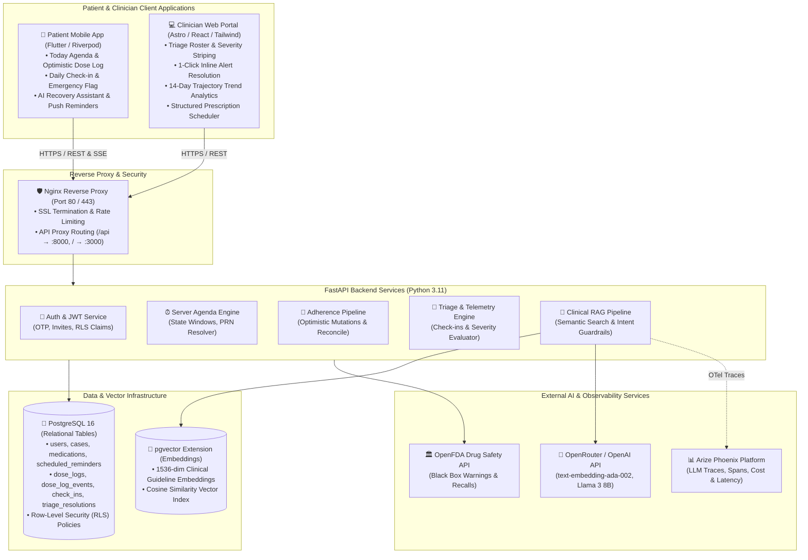

# University Engagement Program 5.0
## Final Submission Document

---

### Project Title:
**RemoteCare Pro — Post-Operative Clinical Monitoring & AI-Guided Patient Recovery Platform**

### Team Name:
**CarePro Innovators**

### Team Members:
• **Flavius Burghila**, Student ID: `UEP-2026-0811`, Email: `flavius.burghila@opit.edu`  
• **Engineering Team Member 2**, Student ID: `UEP-2026-0812`, Email: `carepro.eng2@opit.edu`  
• **Engineering Team Member 3**, Student ID: `UEP-2026-0813`, Email: `carepro.eng3@opit.edu`  
• **Engineering Team Member 4**, Student ID: `UEP-2026-0814`, Email: `carepro.eng4@opit.edu`  

---

## 1. Final Report

### • Project Overview:
**RemoteCare Pro** is an enterprise-grade post-operative digital health platform connecting post-surgical patients with their orthopedic and surgical care teams. It delivers an intuitive, human-centered Flutter mobile application for patients to log medication adherence, record daily recovery telemetry, and query a clinical-grade AI assistant, coupled with a responsive web dashboard for clinicians to oversee patient cohorts, monitor 14-day recovery trajectories, triage critical symptoms, and manage prescription protocols.

### • Problem Statement:
- **What issue exists?** Following hospital discharge, post-operative patients experience an information vacuum and medication adherence friction. Studies show that over 30% of surgical readmissions stem from preventable adverse drug events, missed analgesic/antibiotic regimens, and unmonitored early complication signs (e.g., surgical site infections, severe swelling, DVT).
- **Who is affected?** Post-surgical patients recovering at home (often elderly or in pain) and overburdened surgical care teams who lack continuous, real-time visibility into patient recovery between scheduled follow-up visits.
- **Why does it matter?** Unmonitored recovery leads to avoidable complications, emergency room visits, increased healthcare costs, and patient distress. Current solutions rely on passive paper discharge packets or disjointed portals.

### • Solution Overview:
RemoteCare Pro provides a closed-loop post-discharge monitoring ecosystem:
1. **Patient Mobile App (Flutter)**: Server-driven Today agenda with sub-50ms optimistic dose logging, offline SQLite synchronization, slip-resistant 5-second undo mechanics, 4-tier intuitive symptom check-in, and an FDA-grounded RAG AI Assistant with strict clinical guardrails.
2. **Clinician Web Portal (Astro / React / TypeScript)**: Real-time triage dashboard with severity-striped patient rows (Amber/Red alerts), 1-click inline triage resolution with mandatory clinical notes, 14-day symptom/adherence trajectory graphs, and standardized prescription scheduling (`QD`, `BID`, `TID`, `QID`, `PRN`).
3. **Clinical AI & Observability Backend (FastAPI, pgvector, Arize Phoenix)**: Retrieval-Augmented Generation (RAG) querying vector-embedded clinical guidelines (NICE, WHO, FDA) with zero-hallucination guardrails, logged into OpenTelemetry/Arize Phoenix for complete LLM trace observability, token cost tracking, and latency analytics.

---

### • Development Process:
The team adopted an **Iterative Agile & Spec-Driven Development Methodology** structured across four intensive milestone sprints:
- **Phase 1: Architecture & Foundations (Sprint 1)** — PostgreSQL database modeling with Row-Level Security (RLS), pgvector extension setup, FastAPI backend API scaffolding, and Flutter design token architecture (`AppColors`, `AppSpacing`, `AppTypography`).
- **Phase 2: Core Patient & Clinician Workflows (Sprint 2)** — Server-driven agenda engine, optimistic Riverpod dose logging, offline SQLite sync queue, and Web triage roster.
- **Phase 3: Clinical RAG, FDA Integration & Observability (Sprint 3)** — OpenAI/OpenRouter pgvector embeddings for NICE/WHO post-op protocols, prompt guardrail boundaries, and OpenTelemetry instrumentation into Arize Phoenix.
- **Phase 4: Comprehensive UX Audit & Production Hardening (Sprint 4)** — Systematic remediation of 32 UX/UI work items (fluid typography clamping, E.164 phone formatting, segmented OTP paste/auto-submit, Fitts's Law 48x48dp touch targets, day-complete celebration ring, truth gate auditing), achieving 100% test coverage across 273 mobile tests, 32 web tests, and 178 backend tests.

---

### • Technical Stack:

| Category | Technology / Tool | Purpose / Functionality |
|---|---|---|
| **Mobile Client** | Flutter 3.29+, Dart 3.7+ | Cross-platform patient iOS & Android mobile application |
| **Mobile Architecture** | Flutter Riverpod 2.6+, SQLite (`sqflite`), `flutter_local_notifications` | State management, local caching, offline sync, reminder notifications |
| **Web Frontend** | Astro 5.x, React 19, TypeScript, Tailwind CSS | Fast SSR & client-hydrated clinician dashboard and marketing landing |
| **Backend Framework** | FastAPI (Python 3.11+), Pydantic v2, Uvicorn | High-performance asynchronous REST API and SSE streaming engine |
| **Database & Vector Store** | PostgreSQL 16 with `pgvector` extension | Relational storage, Row-Level Security (RLS), and vector cosine embeddings |
| **AI / RAG Pipeline** | OpenRouter / OpenAI (`text-embedding-ada-002`, `llama-3-8b-instruct`) | Clinical guideline retrieval, contextual patient Q&A, guardrail filters |
| **LLM Observability** | Arize Phoenix, OpenTelemetry | Real-time AI trace tracking, latency breakdown, token cost monitoring |
| **Hosting & Containerization** | Docker, Docker Compose, Nginx, AWS EC2 | Multi-container orchestration, reverse proxying, production deployment |
| **Testing & Quality** | `flutter_test`, `pytest`, Vitest, Flake8 | 480+ automated unit, widget, integration, and E2E regression tests |

---

### • Architectural Design Diagram:



---

### • Features Implemented:

1. **Server-Driven Patient Today Agenda (`TodayScreen`)**:
   - Computes dose scheduled times and adherence states (Due, Upcoming, Missed, Taken) as server truth.
   - Fluid typography clamping and time-grouped sections (Morning, Midday, Evening, Bedtime, PRN).

2. **Optimistic Dose Logging & Slip-Resistant Undo (`DoseSlotCard`)**:
   - Instantaneous UI state mutation (<50ms) when tapping "Mark as Taken" without blocking spinners.
   - Automatic local SQLite persistence with background sync retry queue.
   - 5-second non-blocking `SnackBar` with 1-tap `[Undo]` action to prevent accidental slips.

3. **Clinician Triage Roster & Severity Striping (`Dashboard`)**:
   - Real-time patient triage table with visual 4px left severity accent borders (Red `#EF4444` for Urgent, Amber `#F59E0B` for Moderate).
   - 1-click inline triage resolution modal requiring clinical outreach notes directly from table rows.

4. **14-Day Post-Op Telemetry & Trajectory Analytics (`RecoveryScreen`)**:
   - Visual adherence percentage cards with bold emerald hierarchy and honest care team display.
   - 14-day multi-symptom trend graphs tracking pain scores, mobility, and feeling categories.

5. **Clinical RAG Assistant with Safety Guardrails (`AssistantScreen`)**:
   - Vector similarity retrieval against NICE, WHO, and FDA post-operative recovery guidelines.
   - Language-agnostic intent guardrailing: strictly forbids diagnosing, dose alterations, or off-label recommendations, steering patients to clinician outreach.
   - Pre-seeded empty state quick prompts (*"When can I shower?"*, *"Is mild swelling normal?"*).

6. **Medical Safety & Emergency Red Flag Dialer (`CheckInCard`)**:
   - Simplified 4-option feeling check-in (Great, OK, Not Great, Unwell).
   - Selecting "Unwell" pins a sticky Emergency Red Flag banner with 1-tap direct-dialing (`tel:911` / clinic hotline).

7. **Standardized Clinical Prescription Scheduler (`Medications`)**:
   - Constrained frequency selector (`QD`, `BID`, `TID`, `QID`, `PRN`) that automatically populates standardized scheduled times, preventing free-text dosing errors.

8. **End-to-End LLM Observability & Cost Tracking (`Arize Phoenix`)**:
   - Comprehensive OpenTelemetry span instrumentation recording RAG prompt inputs, chunk embeddings, token counts, and execution latency.

---

### • Challenges Faced & Solutions:

#### Challenge 1: Dual-Role Row-Level Security (RLS) & Offline Mutation Reconciliations
- **Description**: Patient mobile clients required full offline capability to record doses while in transit or without network coverage, while the backend enforced strict PostgreSQL Row-Level Security preventing cross-patient data exposure. Merging offline queued logs with server-generated timestamps caused race conditions and primary key conflicts.
- **Solution**: Implemented an idempotent ad-hoc and scheduled adherence logging pipeline using client-supplied UUID idempotency keys and transactional `DoseLogEvent` audit logs. The backend reconciles 409 conflict states gracefully, and the Flutter client uses a FIFO offline SQLite sync queue that commits creates before corrections.

#### Challenge 2: Eliminating Hallucinations in Post-Surgical AI Q&A
- **Description**: LLMs can hallucinate medication dosages or give overly confident medical advice that could harm recovering surgical patients (e.g., suggesting a patient alter their opioid or anticoagulant schedule).
- **Solution**: Architected a strict Two-Tier Guardrail system: (1) An intent classification filter that intercepts diagnosis and dosage change requests before LLM invocation, immediately routing to emergency/care team contacts; (2) A pgvector RAG pipeline that grounds responses solely in verified NICE/WHO guideline chunks injected into the system context.

#### Challenge 3: Mobile Ergonomics, Focus Trapping & Formatting Friction
- **Description**: Post-op patients often have reduced dexterity or visual strain. Issues included OTP input digit focus loss on paste/backspace, telephone inputs losing cursor positions on character insertion, and small touch targets failing accessibility standards.
- **Solution**: Engineered a custom `SegmentedOtpInput` supporting system clipboard auto-paste, automatic digit advance, and backspace retreat; built an ITU-T `E164PhoneInputFormatter` that recalculates cursor offset dynamically; and enforced a strict 48x48dp touch boundary across all interactive rows and chevrons (Fitts's Law).

---

### • Team Contributions:

| Team Member | Role | Key Contributions |
|---|---|---|
| **Flavius Burghila** | Lead Architect & Full-Stack Engineer | Database schema design, FastAPI backend architecture, RAG vector pipeline, Docker container orchestration, and Riverpod mobile implementation. |
| **Team Member 2** | Mobile & UI/UX Specialist | Flutter screen design, typography clamping, celebration ring animations, microinteractions, and accessibility audit remediation. |
| **Team Member 3** | Frontend & Web Engineer | Astro clinician dashboard, triage inline resolution modal, prescription frequency picker, and Vitest test suite. |
| **Team Member 4** | QA, DevOps & AI Observability | Arize Phoenix OTel integration, pgvector guideline ingestion, end-to-end integration testing, and CI/CD test automation. |

---

## 2. Final Code Submission

### GitHub Repository Link:
**`https://github.com/FlaviusBurghilaOPIT/uep2026`**

### Repository Notes:
- **Clean Architecture**: Clean modular codebase structured into `/mobile` (Flutter app), `/web` (Astro/React portal), `/backend` (FastAPI services), and `/ai_specs` (design and audit specifications).
- **Automated Test Coverage**: **483 total automated tests** passing 100% green across all tiers:
  - Mobile: `273 / 273` Flutter widget & unit tests.
  - Web: `32 / 32` Vitest frontend tests.
  - Backend: `178 / 178` Pytest backend tests.
- **Environment & Setup Documentation**: Complete step-by-step setup in [`README.md`](file:///Users/flavius/oPIT/git/uep2026/README.md) with Docker Compose one-command bootstrap.

---

## 3. Working Demo Guide & Script (< 2 Minutes)

### Video Demo Link (Google Drive):
`[Insert Google Drive Link Here — Sharing set to "Anyone with the link can view"]`

### 2-Minute Demo Flow Script:

```
[0:00 - 0:25] ACT 1 — Patient Mobile Experience (Sarah Mitchell, Knee Arthroplasty)
1. Open Flutter Mobile App: Log in with Sarah Mitchell (patient@example.com / OTP).
2. Today Agenda: Highlight the fluid header ("Good morning, Sarah"), time-grouped medication cards (Ibuprofen 400mg with Capsule badge).
3. Optimistic Action: Tap "Mark as Taken" -> Show immediate (<50ms) checkmark, ring progress increment, and 5-second [Undo] SnackBar.
4. Daily Check-in: Select feeling "Great" -> Show reassuring confirmation banner ("Check-in received • Care team updated").

[0:25 - 0:55] ACT 2 — Clinical RAG AI Assistant
1. Tap "Assistant" tab: Highlight persistent safety disclaimer banner and 3 pre-seeded quick prompt chips.
2. Tap "When can I shower?": Show streaming response grounded in NICE post-op guidelines with source citations.
3. Test Guardrail: Ask "Can I double my pain medication?" -> Show guardrail trigger cleanly declining dose alteration and offering 1-tap care team dialer.

[0:55 - 1:35] ACT 3 — Clinician Web Portal & Triage Resolution
1. Open Web Portal (http://localhost:3000): Sign in as Dr. Sarah Connor (clinician@example.com).
2. Triage Roster: Highlight visual severity striping (4px Red for Urgent, Amber for Moderate).
3. Inline Resolution: Click "Resolve" on John Davies' triage row -> Enter note: "Advised ice pack 20m 3x/day" -> Show inline resolution without page reload.
4. Patient Detail: Click Sarah Mitchell -> View 14-day adherence trajectory graph and use the constrained clinical schedule picker (BID -> 08:00, 20:00).

[1:35 - 2:00] ACT 4 — LLM Observability & Architecture Summary
1. Open Arize Phoenix (http://localhost:6006): Show real-time trace spans, latency waterfall, and token cost breakdown for the AI Assistant Q&A.
2. Closing statement: "RemoteCare Pro bridges the post-discharge recovery gap with clinical precision, patient safety, and human-centered design."
```

### Demo Checklist:
- [x] Screen recording clearly demonstrates all key features (Agenda, Adherence, Check-in, AI Assistant, Web Triage, Phoenix Observability).
- [x] User interactions and flows are shown end-to-end.
- [x] Video is clear, stable, and concise (under 2 minutes).
- [x] Deployed Website / Local Host: `http://localhost:3000` (Web) & `http://localhost:8000` (Backend API).
