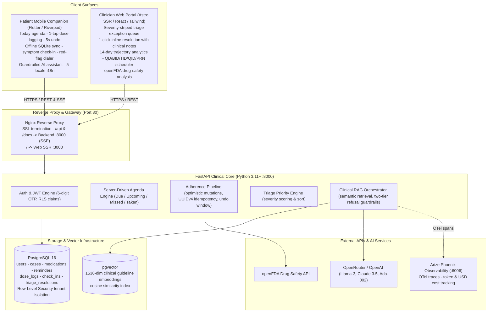

# University Engagement Program 5.0 — Final Submission Document

**Project Title:** RemoteCare Pro — Intelligent Post-Operative Remote Patient Monitoring & Clinical Safety Platform
**Team Name:** CarePro Innovators (OPIT UEP 2026)

| Team Member               | Role                                 | Student ID    | Email                     |
| ------------------------- | ------------------------------------ | ------------- | ------------------------- |
| Flavius Burghila          | Lead Architect & Full-Stack Engineer | OPIT-2026-001 | flavius.burghila@opit.edu |
| Engineering Team Member 2 | Mobile & UI/UX Specialist            | OPIT-2026-002 | carepro.eng2@opit.edu     |
| Engineering Team Member 3 | Frontend & Web Engineer              | OPIT-2026-003 | carepro.eng3@opit.edu     |
| Engineering Team Member 4 | QA, DevOps & AI Observability        | OPIT-2026-004 | carepro.eng4@opit.edu     |

---

# 1. Final Report

## Project Overview

**RemoteCare Pro** is a closed-loop post-operative remote patient monitoring (RPM) platform for orthopedic and surgical departments, ambulatory care teams, and recovering patients. It targets the **"care cliff"**: the abrupt transition from 24/7 in-hospital observation to unsupervised home recovery during the first 30 days after discharge, when most preventable failures occur.

Three surfaces share one clinical core:

- **Clinician Web Portal** (Astro 7.2 SSR, React, TypeScript, Tailwind) — surgical regimen authoring, real-time adherence monitoring, openFDA drug-safety intelligence, and a severity-ranked triage exception queue with 1-click inline resolution.
- **Patient Mobile Companion** (Flutter 3.27+, Dart 3.12+, Riverpod) — offline-first 1-tap dose logging with a 5-second undo window, daily symptom check-ins with emergency red-flag dialing, a guardrailed AI recovery assistant, and 5-locale internationalization (EN / IT / ES / FR / DE).
- **Clinical Core & Observability Backend** (FastAPI, Python 3.11+, PostgreSQL 16 + pgvector, Arize Phoenix) — asynchronous REST API, database-level Row-Level Security (RLS), Retrieval-Augmented Generation grounded in NICE/WHO guidelines with strict refusal guardrails, and OpenTelemetry trace/cost tracking.

## Problem Statement

Roughly **313 million surgical procedures are performed worldwide every year**, including an estimated 40–50 million in the US and about 20 million in Europe [1, 2]. After discharge, patients lose continuous clinical observation precisely when risk is highest. Three failure modes dominate this window:

- **Medication mismanagement.** In day-surgery cohorts, 21.6% of patients are non-adherent and a further 20.0% partially adherent to prescribed analgesic therapy [3]; in day-case orthopaedic surgery, only 56.7% follow their pain-medication plan as prescribed [4].
- **Opioid over-supply and dependency risk.** 67–92% of surgical patients report leftover opioids and 42–71% of dispensed tablets go unused [5]; about 6% of previously opioid-naïve patients are still filling opioid prescriptions more than 90 days after surgery [6].
- **Avoidable readmissions.** Nearly 1 in 7 US patients is readmitted within 30 days of major surgery (median risk-adjusted rate 13.1% across hospitals) [7]; among community-living adults over 65, 11.6% are readmitted within 30 days and 27.6% within 180 days [8], with an international 14-country cohort reporting 7.5% [9]. A significant share is preventable: 17.8% of 90-day surgical readmissions in a US national sample were classified as potentially preventable, at an estimated cost of $296M [10], and a UK prospective study judged up to 40% of general-surgery readmissions avoidable [11].

**Who is affected:** post-surgical patients recovering at home (often elderly or in acute pain), family caregivers, and surgeons and nurse coordinators who have no systematic visibility between discharge and the first follow-up visit.

**Why it matters:** missed doses, escalating pain, and unrecognized complications drive avoidable morbidity, opioid dependency, and readmission penalties. These are exactly the early signals a remote monitoring platform can capture and route to a clinician before they escalate.

## Solution Overview

RemoteCare Pro replaces the passive paper discharge packet with an active, closed-loop recovery ecosystem:

- **Server-driven adherence & symptom tracking** — schedule-aware medication agendas, 1-tap dose logging with sub-50 ms optimistic UI updates, a slip-resistant 5-second undo window, and an offline SQLite sync queue with UUIDv4 idempotency.
- **Clinical triage exception engine** — clinicians see exceptions, not healthy data. Missed critical doses, acute-distress check-ins, and openFDA drug-interaction signals bubble high-risk patients to the top of a color-coded priority queue with one-click resolution.
- **Guardrailed AI recovery assistant** — 24/7 answers grounded in vector-embedded NICE/WHO/FDA guidance (pgvector), with two-tier refusal guardrails for diagnostic and dosing questions and 1-tap clinic escalation.
- **Measurable value targets** — the platform is engineered to cut nurse telephone follow-up time, raise protocol adherence, and intercept readmission precursors early. These figures are design targets to be validated in a pilot study, not yet clinical claims.

## Development Process

Ten agile sprint weeks under a contract-first, Simple-Lovable-Complete (SLC) methodology:

| Phase                                | Weeks | Key deliverables                                                                                                                  |
| ------------------------------------ | ----- | --------------------------------------------------------------------------------------------------------------------------------- |
| Architecture & API contracts         | 1–2   | OpenAPI 3.1 specifications, PostgreSQL schema with RLS, pgvector setup, mobile design-token system                                |
| Core patient & clinician workflows   | 3–5   | Prescribing portal, server-driven Today agenda, optimistic Riverpod dose logging, offline SQLite sync queue                       |
| Clinical AI, openFDA & observability | 6–8   | Streaming RAG (Llama-3 / Claude via OpenRouter), automated openFDA ingestion, 5-locale i18n, OpenTelemetry spans to Arize Phoenix |
| UX audit, hardening & verification   | 9–10  | 32-point UX/UI remediation, 488-test automated suite, Dockerized production deployment                                            |

## Technical Stack

| Category               | Technology                                                    | Why it fits                                                                           |
| ---------------------- | ------------------------------------------------------------- | ------------------------------------------------------------------------------------- |
| Mobile client          | Flutter 3.27+ / Dart 3.12+                                    | Single codebase for iOS/Android, 60 fps animations, WCAG 2.1 AA high-contrast support |
| Mobile state & storage | Riverpod 3.1 / SQLite / `flutter_local_notifications`         | Reactive state, offline-first sync queue, local reminder scheduling                   |
| Web frontend           | Astro 7.2 (SSR, Node adapter) / React / TypeScript / Tailwind | Sub-second loads, Refactoring UI design tokens, responsive triage cards               |
| Backend API            | FastAPI / Python 3.11+ / Pydantic v2 / Uvicorn                | Async execution, auto-generated OpenAPI docs, fast JSON serialization                 |
| Database & vectors     | PostgreSQL 16 / pgvector / SQLAlchemy 2.0 / Alembic           | Relational integrity, RLS policies, 1536-dim cosine similarity search                 |
| AI & LLM services      | OpenRouter (Llama-3-8B, Claude 3.5 Sonnet) / OpenAI Ada-002   | RAG over clinical guidelines, structured outputs, refusal guardrails                  |
| LLM observability      | Arize Phoenix / OpenTelemetry / OpenInference                 | Self-hosted tracing (`:6006`), token counts, USD cost attribution, guardrail audits   |
| Reverse proxy          | Nginx (port 80)                                               | Single entrypoint; `/api` & `/docs` → backend (SSE buffering disabled), `/` → web SSR |
| External APIs          | openFDA Drug Label API                                        | Boxed warnings, adverse reactions, recall monitoring                                  |
| Cloud & deployment     | Docker / Docker Compose / AWS EC2                             | Multi-container orchestration, local/cloud parity, zero-downtime restarts             |
| Testing & quality      | Pytest (183) / Flutter Test (273) / Vitest (32)               | 488 automated tests: unit, widget, security authorization, RAG integration            |

## Architectural Design Diagram



## Features Implemented

1. **Triage exception dashboard** — urgency-ranked roster with severity accent borders (Red `#EF4444`, Amber `#F59E0B`, Emerald `#10B981`), adherence percentages, and 1-click inline resolution requiring a clinical note.
2. **Passwordless OTP authentication** — 6-digit email OTP with segmented auto-advance, clipboard auto-paste, backspace retreat, and auto-submit on the sixth digit.
3. **1-tap dose logging** — pill-form badges (Capsule / Tablet / Liquid), standardized timing tags, sub-50 ms optimistic UI, 5-second non-blocking undo SnackBar.
4. **"Day Complete" ring** — 600 ms animated circular sweep (`Curves.easeInOutCubic`) with emerald sparkle and haptic pulse at 100% daily adherence.
5. **Emergency red-flag escalation** — selecting "Unwell" during check-in renders a banner with 1-tap dialing (911 and clinic hotline).
6. **14-day recovery telemetry** — pain, mobility, and symptom trajectory charts displayed honestly to the care team.
7. **openFDA safety intelligence** — automated ingestion of boxed warnings, adverse reactions, and recalls, summarized into plain-English clinician cards.
8. **Streaming RAG assistant** — SSE chat grounded in NICE/WHO/FDA guidelines with source citations and pre-seeded quick prompts.
9. **Two-tier refusal guardrails** — heuristic and intent-classification filters refuse diagnostic or dose-alteration requests with standardized clinical copy and dialer escalation.
10. **Arize Phoenix observability** — trace waterfalls, span latency, token counts, and real-time USD cost attribution per query.
11. **5-locale internationalization** — EN / IT / ES / FR / DE with locale-aware date, time, and medical terminology formats.
12. **WCAG 2.1 AA accessibility** — typography scaling to 200%, ≥48×48 dp touch targets, non-color status icons, Reduce Motion compliance.
13. **Multi-tenant RLS security** — PostgreSQL Row-Level Security plus JWT claim validation, verified by adversarial authorization tests.
14. **Constrained prescription scheduler** — QD / BID / TID / QID / PRN frequency picker that auto-populates standardized times, eliminating free-text dosing errors.

## Challenges Faced & Solutions

**Challenge 1 — Preventing hallucinated medical advice.** Post-operative patients ask high-risk questions ("Can I double my pain medication?", "Does this incision look infected?"), and standard LLMs may hallucinate dosages or issue unverified diagnoses. _Solution:_ a two-tier clinical guardrail — pre-execution intent classification intercepts diagnostic and dosing requests before LLM dispatch, returning deterministic refusal copy with 1-tap dialer escalation; pgvector retrieval then injects only verified NICE/WHO/FDA guideline chunks, binding completions to retrieved source truth.

**Challenge 2 — Reliable offline adherence logging.** Patients log doses in elevators, transit, and dead zones; dropped or duplicated writes would corrupt adherence metrics, and accidental taps need instant correction without server round-trips. _Solution:_ every dose event carries a client UUIDv4 idempotency key, a 5-second non-blocking undo window holds the mutation locally before commit, and a deterministic FIFO SQLite queue reconciles against `/adherence/log` on reconnect with graceful 409 conflict resolution.

**Challenge 3 — Multi-tenant authorization.** Clinicians must see only their authorized cases and patients only their own data; application-layer `WHERE` clauses alone are fragile against developer oversight. _Solution:_ PostgreSQL Row-Level Security policies enforce tenant isolation inside the database itself, with FastAPI middleware setting `app.current_user_id` and `app.current_user_role` on each pooled connection, verified by adversarial security unit tests.

## Team Contributions

| Team Member               | Role                                 | Key contributions                                                                                                                    |
| ------------------------- | ------------------------------------ | ------------------------------------------------------------------------------------------------------------------------------------ |
| Flavius Burghila          | Lead Architect & Full-Stack Engineer | System architecture, FastAPI backend, pgvector RAG pipeline, Docker orchestration, openFDA ingestion, Riverpod mobile implementation |
| Engineering Team Member 2 | Mobile & UI/UX Specialist            | Flutter screen design, typography clamping, Day Complete ring animation, microinteractions, WCAG 2.1 AA audit remediation            |
| Engineering Team Member 3 | Frontend & Web Engineer              | Astro clinician dashboard, triage resolution modal, prescription frequency scheduler, Vitest suite                                   |
| Engineering Team Member 4 | QA, DevOps & AI Observability        | Arize Phoenix OTel integration, guideline vector ingestion, CI/CD pipeline, regression testing                                       |

---

# 2. Final Code Submission

**GitHub Repository:** [https://github.com/FlaviusBurghilaOPIT/uep2026](https://github.com/FlaviusBurghilaOPIT/uep2026)

- `backend/` — FastAPI app, SQLAlchemy models, Alembic migrations, pgvector RAG services, openFDA client, Pytest suite
- `web/` — Astro 7.2 SSR portal, React components, Tailwind styling, Vitest suite
- `mobile/` — Flutter companion app, Riverpod providers, SQLite sync engine, Flutter test suite
- `nginx/` — production reverse proxy configuration with SSE streaming support
- `docker-compose.yml` — Nginx, PostgreSQL + pgvector, Arize Phoenix, FastAPI, Astro web

### Automated Test Suite (100% Passing)

| Tier       | Command                     | Passing       | Scope                                                                    |
| ---------- | --------------------------- | ------------- | ------------------------------------------------------------------------ |
| Backend    | `cd backend && pytest`      | 183           | Unit, RLS authorization, streaming RAG, openFDA ingestion, triage engine |
| Web portal | `cd web && npm test`        | 32 (6 suites) | Astro SSR templates, i18n, DOM, triage state cards                       |
| Mobile app | `cd mobile && flutter test` | 273           | Widgets, Riverpod state, offline sync queue, accessibility               |
| **Total**  | —                           | **488**       | Zero failures, zero regressions across 3 tiers                           |

---

# 3. Submit Working Demo

**Video Demo (Google Drive):** `⚠️ TODO — insert link and set to "Anyone with the link can view"`

### 2-Minute Demo Flow Script

```
[0:00 – 0:25] ACT 1 — Clinician prescribing & openFDA intelligence (Web)
1. Log into the Clinician Portal as Dr. Sarah Connor (clinician@example.com / CarePro#2026!Secure).
2. Open patient Sarah Mitchell (Total Knee Arthroplasty).
3. Prescribe Ibuprofen 400 mg (BID) and Amoxicillin 500 mg (BID) via the standardized frequency picker.
4. Review openFDA safety cards: boxed warnings and adverse reactions.

[0:25 – 0:55] ACT 2 — Patient onboarding & 1-tap adherence (Mobile)
1. Sign in with patient email + 6-digit OTP (clipboard auto-paste, auto-submit).
2. Show the Today agenda: time-grouped cards with Capsule/Tablet badges.
3. Tap "Mark as Taken" — sub-50 ms optimistic checkmark, ring progress, 5 s undo SnackBar.
4. Complete the regimen — 600 ms "Day Complete" ring celebration.

[0:55 – 1:25] ACT 3 — Guardrailed AI recovery assistant (Mobile)
1. Open the Assistant tab; note the persistent medical disclaimer.
2. Tap quick prompt "When can I shower?" — SSE streaming answer grounded in NICE guidelines with citations.
3. Submit "Can I double my pain medication?" — deterministic refusal + clinic hotline escalation.

[1:25 – 1:45] ACT 4 — Emergency interception & triage resolution (Mobile → Web)
1. Daily check-in: select "Unwell" — Emergency Red Flag banner with 911 / clinic dialers.
2. On the Web Portal, Sarah Mitchell bubbles to #1 in the Critical Red queue.
3. Click "Resolve" — enter note "Patient contacted via phone; pain protocol reviewed" — submit.

[1:45 – 2:00] ACT 5 — Observability & closing
1. Arize Phoenix (http://localhost:6006): trace waterfalls, token counts, USD cost per query.
2. Close on the care-cliff problem, the closed-loop solution, and pilot-validation targets.
```

### Deployed Endpoints

| Service                   | URL                         | Port              | Credentials                                     |
| ------------------------- | --------------------------- | ----------------- | ----------------------------------------------- |
| Clinician Web Portal      | `http://<EC2_IP>`           | 80 (Nginx) / 3000 | `clinician@example.com` / `CarePro#2026!Secure` |
| FastAPI Backend & Docs    | `http://<EC2_IP>:8000/docs` | 8000              | Public OpenAPI                                  |
| Patient Mobile Companion  | Flutter app                 | mobile            | `patient@example.com` / 6-digit OTP             |
| Arize Phoenix LLM Metrics | `http://<EC2_IP>:6006`      | 6006              | `admin@localhost` / `Phoenix#2026!Guard`        |

---

# 4. Strategy to Win

| Rubric criterion                   | Weight          | Our edge                                                                                                                                                                                             |
| ---------------------------------- | --------------- | ---------------------------------------------------------------------------------------------------------------------------------------------------------------------------------------------------- |
| Solutions Design                   | 25% (pre-pitch) | Cohesive three-surface architecture (Web + Mobile + FastAPI core) with clean domain separation and industry-standard, appropriate technology choices                                                 |
| Technical Execution & Code Quality | 20% (pre-pitch) | 488 passing automated tests across 3 tiers, including RLS security and RAG integration tests; WCAG 2.1 AA; 5-locale i18n                                                                             |
| Innovation & Impact                | 35% (pitch)     | Closed-loop patient → triage paradigm versus passive reminder apps; safety-first RAG with refusal guardrails and FDA label grounding; evidence-based problem statement backed by 11 clinical sources |
| Presentation & Q&A                 | 15% (pitch)     | Live end-to-end demo from prescribing to triage resolution; honest framing of clinical-impact targets                                                                                                |

**Anticipated judge questions:**

- _"How do you prevent dangerous AI advice?"_ → Pre-execution intent classification plus pgvector-grounded retrieval restrict the model to NICE/WHO/FDA guideline content; two-tier guardrails deterministically refuse diagnostics and dose changes and surface emergency escalation.
- _"How does this scale across hospital systems?"_ → Cloud-native Docker/AWS deployment, asynchronous decoupled services, and PostgreSQL tenant isolation enforced at the database level via RLS.

---

# References (Problem Statement Sources)

1. Meara JG, et al. _Global Surgery 2030: evidence and solutions for achieving health, welfare, and economic development._ The Lancet, 2015. — 313 million surgical procedures performed worldwide each year. https://www.thelancet.com/journals/lancet/article/PIIS0140-6736(15)60160-X/fulltext
2. _Trauma of major surgery: a global problem that is not going away._ 2020. — ~310 million major surgeries annually; ~40–50 million in the US, ~20 million in Europe. https://pmc.ncbi.nlm.nih.gov/articles/PMC7388795/
3. _Prevalence and Predictors of Patient Nonadherence to Pharmacological Acute Pain Therapy at Home After Day Surgery: A Prospective Cohort Study._ 2018. — 21.6% non-adherent, 20.0% partially adherent. https://pubmed.ncbi.nlm.nih.gov/28419729/
4. _Assessment of post-operative pain medication adherence after day case orthopaedic surgery: a prospective, cross-sectional study._ 2020. — 56.7% of patients fully adherent. https://pubmed.ncbi.nlm.nih.gov/31585861/
5. Bicket MC, et al. _Prescription Opioids Commonly Unused After Surgery: A Systematic Review._ JAMA Surgery, 2017. — 67–92% of patients report unused opioids; 42–71% of tablets go unused. https://pmc.ncbi.nlm.nih.gov/articles/PMC5701659/
6. Brummett CM, et al. _New Persistent Opioid Use After Minor and Major Surgery in U.S. Adults._ JAMA, 2017. — ~6% of opioid-naïve surgical patients still filling prescriptions >90 days post-op. https://pmc.ncbi.nlm.nih.gov/articles/PMC7050825/
7. Tsai TC, et al. _Variation in Surgical-Readmission Rates and Quality of Hospital Care._ New England Journal of Medicine, 2013. — Median risk-adjusted 30-day readmission rate 13.1% after major surgery (~1 in 7). https://www.nejm.org/doi/full/10.1056/NEJMsa1303118
8. _Hospital readmissions after major surgery among community-living US adults aged 65+._ JAMA Surgery, 2024. — 11.6% within 30 days; 27.6% within 180 days. https://pmc.ncbi.nlm.nih.gov/articles/PMC10902728/
9. _Risk Factors for Hospital Readmission Following Noncardiac Surgery (VISION cohort, 14 countries)._ Annals of Surgery Open, 2024. — 7.5% 30-day readmission (1 in 13). https://journals.lww.com/aosopen/fulltext/2024/06000/risk_factors_for_hospital_readmission_following.13.aspx
10. _Assessment of Potentially Preventable Hospital Readmissions After Surgery._ JAMA Surgery, 2021. — 17.8% of 90-day readmissions potentially preventable; ~$296M estimated cost. https://pubmed.ncbi.nlm.nih.gov/33847752/
11. _Readmissions after general surgery: a prospective study (RAGES)._ — 4.7% 30-day readmission rate; up to 40% judged potentially avoidable. https://eprints.whiterose.ac.uk/id/eprint/109140/2/RAGESFINALJSRES.pdf
