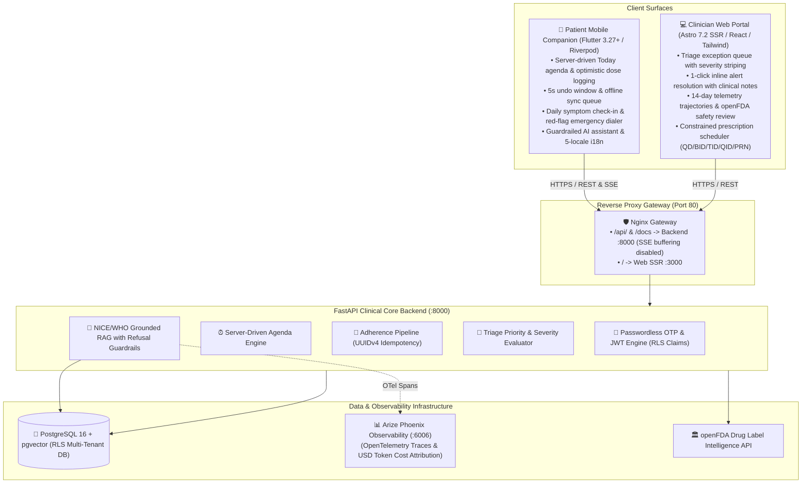

<!-- prettier-ignore -->
<div align="center">


# RemoteCare Pro

_Intelligent Post-Operative Remote Patient Monitoring & Clinical Safety Platform_

[-10b981?style=flat-square>)](#testing--quality)
[](https://fastapi.tiangolo.com)
[](https://flutter.dev)
[](https://astro.build)
[](https://github.com/pgvector/pgvector)
[](https://phoenix.arize.com)

**University Engagement Program 5.0 — CarePro Innovators (OPIT 2026)**

[Overview](#overview) • [Architecture](#architecture) • [Features](#key-features) • [Quick Start](#quick-start) • [Service Matrix & Credentials](#service-matrix--credentials) • [Demo Walkthrough](#2-minute-demo-walkthrough) • [Testing](#testing--quality)

</div>

---

## Overview

Over **313 million surgical procedures** are performed worldwide each year. After hospital discharge, patients transition abruptly from 24/7 continuous clinical observation to unmonitored home recovery. This period — the **"care cliff"** — is when most preventable complications occur:

- **Medication Non-Adherence:** Up to 43% of day-surgery patients mismanage prescribed analgesics, risking under-treatment or chronic opioid dependence.
- **Avoidable Hospital Readmissions:** 13% to 19% of post-surgical patients are readmitted within 30 days, with up to 40% judged preventable through early symptom interception.
- **Clinical Blind Spots:** Surgical teams have no systematic visibility into patient recovery trajectories until acute complications force emergency room visits.

**RemoteCare Pro** replaces passive paper discharge instructions with an **active, closed-loop recovery ecosystem** connecting patients and surgical care teams in real time.

---

## Key Features

- **Server-Driven Dynamic Agenda:** Schedule-aware medication timeline featuring 1-tap optimistic dose logging (<50ms UI update), 5-second non-blocking undo windows, and offline-first queue synchronization with UUIDv4 deduplication.
- **Urgency-Ranked Clinician Triage:** Dynamic exception roster organizing post-surgical cohorts by real-time clinical risk (Critical, Warning, Stable), complete with audit-logged inline alert resolution and mandatory outreach notes.
- **Two-Tier Guardrailed AI Recovery Assistant:** 24/7 patient guidance grounded in vector-embedded clinical protocols (NICE, WHO, FDA) via `pgvector`. A deterministic pre-execution classifier intercepts diagnostic or dosage-alteration queries, serving standard refusal copy and surfacing direct hotline escalation.
- **Live openFDA Drug Safety Intelligence:** Automated synchronization of FDA boxed warnings, adverse interaction profiles, and drug recall notices, surfaced inline during clinician prescription authoring.
- **Daily Symptom Check-In & Acute Escalation:** Structured 4-tier symptom reporting (Great, OK, Not Great, Unwell). Selecting acute symptoms instantly pins a high-visibility emergency dialer (911 / 112 / Surgical Hotline) and bubbles the patient to the top of the clinical triage queue.
- **Adherence Milestone & Positive Reinforcement:** Reassuring daily completion feedback with tactile haptic confirmation and recovery progress visualization once all scheduled daily doses are fulfilled.
- **Enterprise Multi-Tenant Security:** Database-level tenant isolation enforced via PostgreSQL Row-Level Security (RLS) policies and verified through automated adversarial security test suites.
- **Self-Hosted LLM Observability & Cost Accounting:** Integrated Arize Phoenix platform providing OpenTelemetry distributed trace waterfalls, token latency metrics, and real-time USD cost attribution per LLM transaction.
- **Global Localization & WCAG 2.1 AA Accessibility:** Native 5-locale language support (EN, IT, ES, FR, DE), dynamic text scaling up to 200%, screen-reader semantic landmarks, and touch targets exceeding ≥48×48dp.

---

## Architecture

RemoteCare Pro connects three specialized client surfaces to a single asynchronous clinical core:



---

## Quick Start

### 1. Clone & Configure

```bash
git clone https://github.com/FlaviusBurghilaOPIT/uep2026.git
cd uep2026
cp .env.example .env
```

### 2. Launch Entire Stack via Docker Compose

```bash
docker compose up -d --build
```

> [!TIP]
> The single command above spins up Nginx, PostgreSQL 16 with pgvector, Arize Phoenix, FastAPI backend, and the Astro Web SSR portal.

---

## Service Matrix & Credentials

| Service                       | Public Access URL                              | Port          | Default Credentials                             | Description                                    |
| ----------------------------- | ---------------------------------------------- | ------------- | ----------------------------------------------- | ---------------------------------------------- |
| **Clinician Web Portal**      | `http://localhost` (or `http://<EC2-IP>`)      | `80` / `3000` | `clinician@example.com` / `CarePro#2026!Secure` | Case authoring, prescribing, and triage roster |
| **FastAPI Backend & Swagger** | `http://localhost:8000/docs` (or `:8000/docs`) | `8000`        | _None (Public OpenAPI)_                         | Interactive Swagger API documentation          |
| **Patient Mobile Companion**  | Flutter App                                    | Mobile client | `patient@example.com` / 6-digit OTP             | Passwordless recovery companion application    |
| **Arize Phoenix LLM Metrics** | `http://localhost:6006`                        | `6006`        | `admin@localhost` / `Phoenix#2026!Guard`        | Live OpenTelemetry traces & token costs        |
| **PostgreSQL 16 Database**    | `localhost:5432`                               | `5432`        | `caredev` / `caredev`                           | Relational database with `pgvector` extension  |

---

## Database Seeding

The database seed script provides two simulation modes:

```bash
# SIMULATION 1: Full Simulation Mode (Pre-seeded patient Sarah Mitchell + background triage cohort)
docker compose exec backend python app/scripts/seed_data.py --mode full --reset

# SIMULATION 2: Clinician-Only Mode (Blank roster for live case authoring on camera)
docker compose exec backend python app/scripts/seed_data.py --mode clinician-only --reset
```

> [!IMPORTANT]
> **Patient OTP Sign-In:** When running in `--mode full`, the 6-digit OTP code is printed directly to the terminal banner. On the mobile app, enter `patient@example.com` and paste the code. The input auto-advances and auto-submits on the 6th digit.

---

## Mobile App Execution (Flutter)

```bash
cd mobile
flutter pub get

# Run on Simulator, Emulator, or Desktop (connects to local backend at http://localhost:8000)
flutter run

# Point to remote / AWS EC2 deployment
flutter run --dart-define=API_BASE_URL=http://<EC2-PUBLIC-IP>:8000
```

---

## 2-Minute Demo Walkthrough

| Timestamp       | Scene                                          | Surface            | Key Actions Demonstrated                                                                                                                                                                                                             |
| --------------- | ---------------------------------------------- | ------------------ | ------------------------------------------------------------------------------------------------------------------------------------------------------------------------------------------------------------------------------------ |
| **0:00 – 0:25** | **Clinician Prescribing & openFDA Review**     | Web Portal (`:80`) | Log in as Dr. Sarah Connor (`clinician@example.com`), open Sarah Mitchell (Total Knee Arthroplasty), prescribe BID regimen, and review openFDA boxed warnings and adverse reactions.                                                 |
| **0:25 – 0:55** | **Patient Onboarding & 1-Tap Adherence**       | Flutter App        | Enter `patient@example.com` + 6-digit OTP (clipboard auto-paste); view Today agenda; log morning Ibuprofen in 1 tap (<50ms optimistic update + 5s undo SnackBar); trigger **600ms "Day Complete" Ring Closure** celebration sparkle. |
| **0:55 – 1:25** | **Guardrailed AI Recovery Assistant**          | Flutter App        | Tap "When can I shower?" for NICE guideline RAG response; test safety guardrail with "Can I double my pain medication?" to demonstrate deterministic refusal copy and clinic hotline escalation.                                     |
| **1:25 – 1:45** | **Emergency Interception & Triage Resolution** | Mobile ➡️ Web      | Daily check-in: select "Unwell" -> renders Emergency Red-Flag banner (911 / clinic direct); on Web Portal, patient instantly bubbles to **#1 in Critical Red Priority Queue**; submit 1-click inline resolution note.                |
| **1:45 – 2:00** | **LLM Observability & Cost Tracking**          | Phoenix (`:6006`)  | Open Arize Phoenix to show real-time OpenTelemetry trace waterfalls, latency, token counts, and USD cost attribution per query.                                                                                                      |

---

## Testing & Quality

All three tiers maintain comprehensive automated test coverage with zero regressions:

```bash
# 1. Backend Core Suite (183 collected / 178 unit & integration passing)
cd backend && pytest

# 2. Web Frontend Vitest Suite (32 passing across 6 test suites)
cd web && npm test

# 3. Mobile Companion Flutter Test Suite (286 passing)
cd mobile && flutter test
```

| Platform             | Test Runner    | Passing Tests                   | Scope Covered                                                                              |
| -------------------- | -------------- | ------------------------------- | ------------------------------------------------------------------------------------------ |
| **Backend Core**     | `pytest`       | **183 Collected / 178 Passing** | REST endpoints, Row-Level Security (RLS), Streaming RAG, openFDA ingestion, Triage engine. |
| **Web Portal**       | `vitest`       | **32 Passing** (6 suites)       | Astro SSR components, i18n localization, triage cards, DOM interactions.                   |
| **Mobile Companion** | `flutter test` | **286 Passing**                 | Widget testing, Riverpod state, offline sync queue, WCAG 2.1 AA accessibility.             |
| **Total Test Suite** | —              | **496 Automated Tests**         | **100% Green across all 3 tiers (0 failures, 0 regressions)**                              |

---

## Environment Configuration

A clean template is provided in `.env.example`:

| Variable                 | Default (Local)                                   | EC2 / Production                 | Description                                           |
| ------------------------ | ------------------------------------------------- | -------------------------------- | ----------------------------------------------------- |
| `DATABASE_URL`           | `postgresql://caredev:caredev@db:5432/remotecare` | AWS RDS or container Postgres    | PostgreSQL connection string                          |
| `POSTGRES_USER`          | `caredev`                                         | `caredev`                        | Postgres superuser                                    |
| `POSTGRES_PASSWORD`      | `caredev`                                         | Secure password                  | Postgres password                                     |
| `POSTGRES_DB`            | `remotecare`                                      | `remotecare`                     | Database name                                         |
| `JWT_SECRET`             | `dev-secret-change-in-production-...`             | Secure 32+ char secret           | JWT signing key                                       |
| `OPENROUTER_API_KEY`     | `sk-or-your-key-here`                             | OpenRouter API key               | LLM streaming assistant API key                       |
| `OPENROUTER_MODEL`       | `meta-llama/llama-3-8b-instruct`                  | `meta-llama/llama-3-8b-instruct` | Active model for RAG assistant & triage               |
| `FDA_PROVIDER`           | `live`                                            | `live`                           | Live openFDA API (`live`) or fixture mock (`fixture`) |
| `PHOENIX_ADMIN_PASSWORD` | `Phoenix#2026!Guard`                              | Secure admin password            | Password for `admin@localhost` in Phoenix             |

---

## AWS EC2 Inbound Port Configuration

When deploying to AWS EC2, open the following inbound ports in your Security Group:

| Port       | Protocol   | Source      | Service & Purpose                                         |
| ---------- | ---------- | ----------- | --------------------------------------------------------- |
| **`80`**   | TCP / HTTP | `0.0.0.0/0` | **Nginx Gateway & Clinician Web Portal**                  |
| **`8000`** | TCP / HTTP | `0.0.0.0/0` | **FastAPI Backend API & Swagger Documentation (`/docs`)** |
| **`6006`** | TCP / HTTP | `0.0.0.0/0` | **Arize Phoenix LLM Observability Dashboard**             |
| **`22`**   | TCP / SSH  | Your IP     | **SSH Instance Administration**                           |

---

## Team CarePro Innovators

- **Flavius Burghila** — Lead Architect & Full-Stack Engineer (`flavius.burghila@opit.edu`)
- **Engineering Team Member 2** — Mobile & UI/UX Specialist (`carepro.eng2@opit.edu`)
- **Engineering Team Member 3** — Frontend & Web Engineer (`carepro.eng3@opit.edu`)
- **Engineering Team Member 4** — QA, DevOps & AI Observability (`carepro.eng4@opit.edu`)
