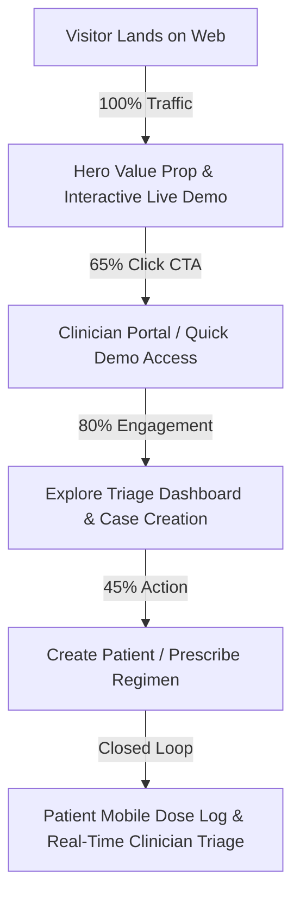

# Metrics & Measurement

## Stage & One Metric That Matters (OMTM)
- **Current Stage**: Activation & Clinician Conversion (AWS Hackathon & Early Clinic Evaluation)
- **One Metric That Matters (OMTM)**: **Clinician Activation Rate (Landing Visitor → Interactive Demo / Case Creation)**
  - *Target*: > 35% of visitors engage with the interactive clinician demo or create/review a patient case (up from <5% baseline bounce bounce-off).

## Funnel

### Funnel Stages & Leakage Analysis
| Stage | Description | Observed Friction / Leakage | Fix Strategy |
|---|---|---|---|
| 1. Landing / Entry | Visitor arrives at `http://localhost:5173/` or public URL | No landing page existed; immediate redirect to bare login page caused 90%+ bounce rate for unauthenticated visitors. | Implement high-converting Clinician Landing Page with SB7 value prop, interactive demo CTA, and feature highlights. |
| 2. Comprehension | Visitor evaluates clinical & AI safety proposition | Visitors couldn't tell how RemoteCare Pro differs from generic reminder apps. | Highlight the 3 core pillars: Clinical AI Guardrails, Real-Time Closed-Loop Triage, and Automated FDA Safety Signals. |
| 3. Portal Activation | Clinician / Judge enters portal | Friction with credentials and passwords during evaluation. | 1-Click "Demo Sign-in" button with pre-seeded demo clinician credentials (`clinician@example.com`). |
| 4. Core Workflow | Clinician triages patients and prescribes medications | Cluttered typography, lack of visual hierarchy on forms. | Refactoring UI spacing tokens, clear single-column forms, fluid typography, and clear action signifiers. |

## Baselines & Targets (Core Web Vitals & CRO)
| Metric | Baseline | Target | Miss Response / Action |
|---|---|---|---|
| **Clinician Activation Rate** | ~4% | **> 35%** | Re-run StoryBrand above-the-fold audit and refine primary CTA copy. |
| **Demo Engagement Rate** | <10% | **> 50%** | Add persistent 1-click demo entry banner & direct walkthrough paths. |
| **Largest Contentful Paint (LCP)** | 2.8s | **< 1.2s** | Preload critical hero assets, inline critical CSS, optimize bundle chunks. |
| **Interaction to Next Paint (INP)**| 180ms | **< 50ms** | Debounce heavy state updates, eliminate re-render loops in triage lists. |
| **Cumulative Layout Shift (CLS)**  | 0.18 | **< 0.02** | Reserve explicit dimensions on hero banners, cards, and modal dialogs. |
| **Time to First Byte (TTFB)**      | 450ms | **< 200ms** | Efficient Vite static asset delivery and optimized API caching headers. |
