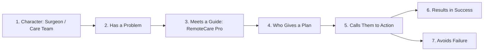

# Positioning & Messaging

## Commander's Intent
> **"Every visitor and patient must instantly understand that RemoteCare Pro is a clinician-authored, closed-loop post-op recovery platform with guardrailed AI and live FDA safety — delivering effortless dose execution for patients, complete all-inclusive clinical tooling for care teams, and sub-60s triage."**

---

## Product Architecture & Commercial Model
- **All-Inclusive Clinical License**: When deployed at a clinic, surgical center, or hospital system, **100% of capabilities are fully unlocked** (unlimited patient rosters, real-time closed-loop triage, Clinical Guardrailed AI, and live openFDA FAERS adverse drug surveillance).
- **Zero Dark Patterns / Zero Tier Gating**: No artificial feature locks, hidden upcharges, or paywall friction for clinical care teams.

---

## One-Liner (StoryBrand)
**"We help surgeons and clinical care teams who struggle with post-operative patient drop-off and medication non-adherence to monitor recovery in real time with guardrailed Clinical AI and live FDA safety intelligence."**

---

## Brand Script (StoryBrand SB7 Framework)

### 1. Character (The Hero)
- **Who**: Orthopedic, cardiac, and general surgical care teams, clinic directors, and post-discharge recovery coordinators.
- **What they want**: 100% visibility into patient recovery between hospital discharge and follow-up visits, ensuring patients take their prescribed medications safely and on schedule.

### 2. The Problem (Three Levels)
- **External Problem**: Up to 50% of post-surgery patients fail to take prescribed medications correctly or report adverse side effects before complications arise.
- **Internal Problem**: Clinicians and surgeons suffer anxiety over blind recovery windows, fear of preventable 30-day readmissions, and lack of actionable telemetry.
- **Philosophical Problem**: In the era of modern cloud computing and AI, no patient should have to navigate complex surgical recovery alone and unmonitored.

### 3. The Guide (RemoteCare Pro)
- **Empathy**: We understand that clinicians don't have hours for manual paperwork or confusing software.
- **Authority**: Built on modern cloud architecture with Clinical RAG Guardrails, PostgreSQL pgvector embeddings, and live openFDA FAERS adverse event telemetry.

### 4. The 3-Step Plan
1. **Prescribe in 30 Seconds**: Doctor creates a case and selects prescribed regimen; zero manual setup for the patient.
2. **Patient Logs in 1 Tap**: Patient receives auto-generated dose schedules and logs doses in 1 tap on iOS/Android.
3. **Real-Time Triage & Guardrailed AI**: Clinician dashboard immediately flags missed doses or severe symptoms, while patients get 24/7 safe, non-diagnostic answers.

### 5. Calls to Action (Dual CTAs)
- **Direct CTA**: `[Launch Live Clinician Demo →]` (Instant test session with preloaded clinical cohorts).
- **Transitional CTA**: `[Explore FDA Safety Intelligence]` & `[View 3-Minute Demo Playbook]`.

### 6. Results in Success
- 90%+ medication adherence rates across post-op cohorts.
- Sub-60-second clinician triage response time on critical alerts.
- Patient confidence through 24/7 guardrailed AI companion and FDA safety transparency.

### 7. Avoids Failure
- Preventable emergency room visits and costly 30-day hospital readmissions.
- Silent adverse drug reactions (ADRs) going unnoticed until acute crisis.
- Overwhelmed clinical staff spending hours on manual phone tag.

---

## Screen-by-Screen Commander's Intent

| Screen Surface | Commander's Intent (The Core Takeaway) |
|---|---|
| **Mobile Today Agenda** | *"You have 1 dose due right now. Tap green to log it, and you're done."* |
| **Mobile AI Assistant** | *"Ask anything about your medications. We give safe, doctor-vetted answers and escalate emergencies immediately."* |
| **Mobile Recovery Milestones** | *"You're on Day 4 of 14 with 100% adherence. Your surgical care team sees your progress."* |
| **Mobile Onboarding (Access Key)**| *"Enter the 6-digit access code sent to your email upon hospital discharge."* |
| **Web Clinician Triage** | *"Identify at-risk patients who missed critical doses and intervene in under 60 seconds."* |

---

## Key Messages (SUCCESs & Cialdini Framework: Honest Influence)

| Message Surface | Lead Principle | SUCCESs Score (1-10) | Concrete High-Stick & Honest Rewrite |
|---|---|---|---|
| **Clinician Pilot Onboarding (Web)** | **Authority + Reciprocity** | 9 (High Trust) | **"Deploy all-inclusive closed-loop care across your entire surgical department. Full adherence tracking, Clinical AI guardrails, and FDA FAERS surveillance included from Day 1."** |
| **openFDA FAERS Intelligence** | **Authority + Social Proof** | 9 (High Trust) | **"Live openFDA integration indexes 20M+ adverse drug reaction records to surface critical black-box warnings and interaction risks in real time."** |
| **Patient Daily Habit Prompt** | **Commitment & Consistency** | 9 (Empathetic) | **"You committed to Dr. Miller's 14-day protocol. Over 92% of patients stay on schedule with timely morning logging."** |
| **Hero Headline (Web)** | **Clarity / Outcome** | 9 (Concrete) | **"Close the Post-Op Recovery Gap with Real-Time Clinical Triage & Guardrailed AI."** |
| **Mobile Dose Due Card** | **Direct Action** | 9 (Concrete) | **"Morning Dose Due: 1 capsule of Amoxicillin 500mg (Take with breakfast)."** |
| **Mobile AI Safety Pill** | **Authority / Safety** | 9 (Clear Boundary) | **"Clinical AI Companion: Doctor-vetted guidance, 100% non-diagnostic."** |
| **Mobile Symptom Check-in Result**| **Empathy / Reassurance** | 9 (Human) | **"We've alerted Dr. Miller's surgical care team. An on-call nurse will review this shortly."** |
| **Clinician 1-Click Demo** | **Liking & Reciprocity** | 10 (Frictionless) | **"Launch Live Clinician Demo (1-Click Instant Access) →"** |
