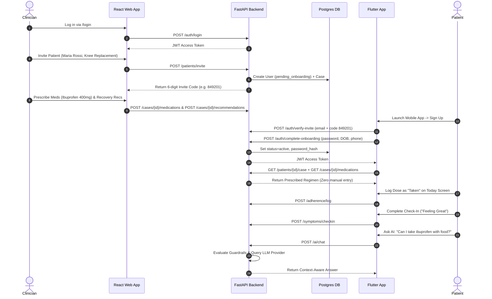

# Remote CarePro — Codebase and Product Inventory

**Document ID:** `docs/product/00-codebase-inventory.md`  
**Generated Date:** 2026-07-22  
**Role:** Lead Product, UX, and Technical-Design Agent  
**Status:** Baseline Factual Audit (No application code modified)

---

## 1. Repository Structure & Tree

The repository is structured into isolated track directories with a contract-first architecture. Below is the complete factual file tree grouped by subsystem.

```
uep2026/
├── CLAUDE.md                      # RTK & ACT workflow instructions
├── README.md                      # General project overview & setup guide
├── docker-compose.yml             # Local Docker setup (FastAPI + Postgres + Mock Server)
├── .env.example                   # Baseline environment configuration template
├── seed_test.db                   # SQLite database artifact (local testing)
├── skills-lock.json               # Skill lock file
│
├── .act/                          # ACT Workflow storage & semantics
│   ├── config.yaml
│   └── workflow.md
│
├── .agents/                       # Intent & Design System Skills
│   └── skills/ (articulate, blueprint, evaluate, fortify, include, intent,
│                investigate, journey, localize, measure, organize,
│                philosopher, specify, storytelling, strategize, transpose, wireframe)
│
├── ai_specs/                      # Technical specifications & execution ledgers
│   ├── 2026-07-22-flutter-mobile-enhancements-spec.md
│   ├── 2026-07-22-flutter-mobile-enhancements-ledger.md
│   └── work-items/
│
├── backend/                       # FastAPI (Python 3.12+) Service
│   ├── Dockerfile
│   ├── alembic.ini
│   ├── pyproject.toml
│   ├── requirements.txt
│   ├── app/
│   │   ├── main.py                # FastAPI entry point & router registrations
│   │   ├── database.py            # SQLAlchemy database connection session
│   │   ├── dependencies.py        # Auth dependencies, RLS session context & role checks
│   │   ├── models.py              # SQLAlchemy ORM model definitions (11 entities)
│   │   ├── schemas.py             # Pydantic v2 validation & response schemas
│   │   ├── security.py            # Password hashing (bcrypt) & JWT token generation
│   │   ├── observability.py       # Basic OpenInference tracing setup
│   │   ├── api/                   # Legacy/alternate router endpoints (ai.py, fda.py)
│   │   ├── core/                  # Database initialization & config
│   │   ├── models/                # Additional DB schemas (base.py, embeddings.py)
│   │   ├── providers/             # Pluggable adapter interfaces
│   │   │   ├── auth.py            # AuthProvider (LocalAuthProvider, CognitoAuthProvider)
│   │   │   ├── fda.py             # FDAProvider (LiveFDAProvider, FixtureFDAProvider)
│   │   │   └── llm.py             # LLMProvider (MockLLMProvider, OpenRouterProvider)
│   │   ├── routers/               # Endpoint routers
│   │   │   ├── adherence.py       # Dose logging & adherence retrieval
│   │   │   ├── ai.py              # Bedrock/LLM Chatbot with guardrails
│   │   │   ├── auth.py            # Auth endpoints (login, invite verification, onboarding)
│   │   │   ├── cases.py           # Patient cases & emergency contact management
│   │   │   ├── checkins.py        # Daily symptom check-ins & trends
│   │   │   ├── fda.py             # openFDA drug search & warning moderation queue
│   │   │   ├── medications.py     # Medication prescribing & deletion
│   │   │   ├── patients.py        # Patient invite & profile endpoints
│   │   │   ├── recommendations.py # Recovery instructions endpoints
│   │   │   ├── reminders.py       # Scheduled reminder CRUD
│   │   │   ├── users.py           # Direct user creation (clinician)
│   │   │   └── wiki.py            # Auto-generated recovery wiki articles
│   │   ├── services/              # RAG & guideline seeding services (rag.py, seed_guidelines.py)
│   │   └── scripts/               # DB seed scripts (seed_db.py, verify_seed.py)
│   ├── alembic/                   # Database migration files
│   └── tests/                     # Pytest suite (16 test modules covering auth, RLS, FDA, AI, etc.)
│
├── mobile/                        # Flutter (Dart) Patient Mobile App
│   ├── pubspec.yaml / pubspec.lock
│   ├── analysis_options.yaml
│   ├── l10n.yaml                  # Localization config
│   ├── README.md                  # Mobile setup & run instructions
│   ├── assets/images/             # UI Tab icons & illustrations (Home, CheckIn, Assistant, Recovery, drug)
│   ├── lib/
│   │   ├── main.dart              # App initialization, ScreenUtil, Riverpod & Local Notifications
│   │   ├── core/                  # Shared core infrastructure
│   │   │   ├── config/            # App environment config
│   │   │   ├── constants/         # App constants & styling
│   │   │   ├── l10n/              # Localization files & language notifier
│   │   │   ├── navigation/        # AppRoutes (Named route generator)
│   │   │   ├── network/           # API HTTP client / Dio setup
│   │   │   ├── notifications/     # NotificationService (flutter_local_notifications)
│   │   │   ├── providers/         # Global Riverpod providers
│   │   │   ├── services/          # Local storage / secure storage
│   │   │   ├── shared_widgets/    # MainBottomNav
│   │   │   ├── theme/             # AppTheme (Light theme design tokens)
│   │   │   └── widgets/           # Shared reusable UI components
│   │   └── features/              # Feature modules (Riverpod + Screen controllers)
│   │       ├── assistant/         # AI Assistant Chat screen & Freezed providers
│   │       ├── auth/              # Onboarding, Login, 3-Step Signup, Forgot Password
│   │       ├── checkin/           # Daily feeling check-in screen
│   │       ├── main/              # MainShellPage (IndexedStack 4-tab container)
│   │       ├── profile/           # User profile & settings screen
│   │       ├── recovery/          # Recovery instructions, emergency contact, FDA info
│   │       └── today/             # Today's agenda, medication dosage cards & adherence logging
│   └── test/                      # Flutter widget & unit tests
│
├── web/                           # React + TypeScript (Vite) Clinician Dashboard
│   ├── Dockerfile
│   ├── package.json / package-lock.json
│   ├── vite.config.ts
│   ├── tsconfig.json / tsconfig.app.json / tsconfig.node.json
│   ├── eslint.config.js
│   ├── README.md
│   └── src/
│       ├── main.tsx               # React entry point
│       ├── App.tsx                # React Router v6 setup & layout shell
│       ├── App.css / index.css    # Global styling rules
│       ├── api/client.ts          # Centralized fetch client (attaches JWT Bearer token)
│       ├── assets/                # Hero image assets
│       ├── components/
│       │   └── NavBar.tsx         # Clinician web sidebar navigation
│       └── pages/                 # Clinician authoring screens
│           ├── LoginPage.tsx              # Clinician auth login
│           ├── PatientsPage.tsx           # Patient list & case sub-items
│           ├── CreatePatientPage.tsx      # Patient invitation & invite code generator
│           ├── CreateCasePage.tsx         # New case creation page
│           ├── MedicationsPage.tsx        # Prescribe medication form with FDA lookup link
│           ├── MedicationsListPage.tsx    # List medications for a case
│           ├── RecommendationsPage.tsx    # Add recovery instructions + AI assistant drawer
│           ├── RecommendationsListPage.tsx# List recovery instructions for a case
│           └── FDAPage.tsx                # On-demand openFDA drug safety search tool
│
├── mock/                          # OpenAPI 3.0.3 Contract & Mock Server
│   └── openapi.yaml               # Complete API spec for Prism mock server (port 8001)
│
└── docs/                          # Project Documentation
    ├── DESIGN.md                  # High-level product design, AWS architecture & trade-offs
    ├── PLAN.md                    # 5-person team SLC implementation plan
    ├── requirements-core.MD       # Core requirements & feature specifications
    ├── requirements               # Core requirements mirror file
    ├── trello-import.csv          # Task breakdown & test criteria
    ├── product/                   # Product strategy & specifications folder (target)
    └── ux/                        # UX research & design specs folder (target)
```

---

## 2. Implemented Screens & Routes

### 2.1 Web Dashboard (React + TypeScript)
- `/login` (`LoginPage.tsx`): Clinician authentication portal. Accepts email and password, executes `POST /auth/login`, and persists JWT access token and user role to `localStorage`.
- `/patients` (`PatientsPage.tsx`): Patient overview dashboard. Displays list of patients, DOB, allergies, and associated surgery cases. Provides action buttons to invite new patients, create cases, and view medication/recommendation lists.
- `/patients/new` (`CreatePatientPage.tsx`): Patient onboarding trigger. Clinician submits full name, email, surgery type, and emergency contact phone (`POST /patients/invite`). Generates and displays a 6-digit invitation code for mobile onboarding.
- `/cases/new` (`CreateCasePage.tsx`): Case authoring view. Clinician selects an existing patient and assigns a surgery type (`POST /cases`), redirecting to prescribing workflows.
- `/cases/:caseId/medications` (`MedicationsPage.tsx`): Medication prescribing view. Clinician enters drug name, dose, frequency, duration in days, and optional notes (`POST /cases/:caseId/medications`). Includes direct trigger for FDA safety lookup.
- `/cases/:caseId/medications/list` (`MedicationsListPage.tsx`): Case medication roster (`GET /cases/:caseId/medications`).
- `/cases/:caseId/recommendations` (`RecommendationsPage.tsx`): Recovery instruction editor (`POST /cases/:caseId/recommendations`). Features an integrated AI assistant drawer powered by `/ai/chat` for drafting clinical guidelines.
- `/cases/:caseId/recommendations/list` (`RecommendationsListPage.tsx`): Case recovery instructions list (`GET /cases/:caseId/recommendations`).
- `/fda` (`FDAPage.tsx`): Standalone FDA drug safety search tool. Performs live/fixture lookup (`GET /fda/drug/{name}`), renders plain-language AI safety summaries, warnings, and links to the official FDA database.

### 2.2 Mobile App (Flutter / Dart)
- `/onboarding` (`OnboardingScreen`): Welcome carousel & entry portal (Initial route).
- `/login` (`LoginScreen`): Direct user login interface for returning patients.
- `/signup/step1` (`SignupStep1Screen`): Patient invitation verification. Verifies 6-digit invite code and patient email (`POST /auth/verify-invite`).
- `/signup/step2` (`SignupStep2Screen`): Account security setup. Collects and validates patient password.
- `/signup/step3` (`SignupStep3Screen`): Patient profile completion. Collects date of birth and phone number, completing onboarding (`POST /auth/complete-onboarding`).
- `/forgot-password` (`ForgotPasswordScreen`): Password recovery request interface.
- `/main` (`MainShellPage`): Main application container using an `IndexedStack` with a custom bottom navigation bar (`MainBottomNav`), hosting 4 core screens:
  1. **Today Tab** (`TodayScreen`): Patient daily operational hub. Displays current prescribed medications, scheduled dosages, adherence logging buttons (`taken`, `missed`, `skipped`), and daily adherence summary metrics.
  2. **Check-In Tab** (`CheckInScreen`): Daily recovery feeling submission (`great`, `ok`, `not_great`, `bad`) sent via `POST /symptoms/checkin`.
  3. **Assistant Tab** (`AssistantScreen`): 24/7 AI Recovery Assistant chat view (`POST /ai/chat`). Displays context-bounded replies and handles out-of-scope guardrail warnings.
  4. **Recovery Tab** (`RecoveryScreen`): Structured recovery care plan. Displays clinician-authored activity & wound care instructions, clinician emergency contact card, and prescribed drug safety summaries.
- `/profile` (`ProfileScreen`): User profile settings, emergency contact details, language selector, and logout handler.

---

## 3. User Roles, Auth Flows, API Contracts & Backend Endpoints

### 3.1 User Roles
- `clinician`: Case manager & author of treatment plans. Can invite patients, create cases, prescribe medications, add recovery instructions, and access FDA warning queues.
- `patient`: Treatment recipient. Can complete invite onboarding, view prescribed regimen, log dose adherence, record daily feeling check-ins, and query the AI assistant.
- `admin`: Administrative role with elevated platform permissions.

### 3.2 Authentication & Onboarding Flows
- **Pluggable Architecture**: Configured via `AUTH_PROVIDER` (`local` vs. `cognito`).
- **Local Auth Engine**:
  - Clinician Login: `POST /auth/login` verifies bcrypt password hash and returns an HS256 JWT containing `{ sub, role, email }`.
  - Patient Invitation & Onboarding:
    1. Clinician calls `POST /patients/invite` $\rightarrow$ creates a `User` (status: `pending_onboarding`, role: `patient`, 6-digit `invite_code`) and an initial `Case`.
    2. Patient enters email + invite code on mobile $\rightarrow$ `POST /auth/verify-invite` validates pending status.
    3. Patient submits password, DOB, phone $\rightarrow$ `POST /auth/complete-onboarding` sets password hash, activates user status, and returns a valid Bearer JWT.
- **Cognito Auth Engine**: `CognitoAuthProvider` validates JWT signatures against AWS Cognito JWKS endpoints (`https://cognito-idp.{region}.amazonaws.com/{pool_id}/.well-known/jwks.json`) and extracts `custom:role` and `sub` claims.

### 3.3 Database Models (SQLAlchemy Declarative ORM)
1. `User`: `id` (UUID), `email`, `full_name`, `role` (enum), `password_hash`, `cognito_sub`, `invite_code`, `status`, `phone`, `date_of_birth`, `created_at`.
2. `Case`: `id` (UUID), `clinician_id` (FK), `patient_id` (FK), `surgery_type`, `status`, `emergency_contact_name`, `emergency_contact_phone`, `created_at`.
3. `Medication`: `id` (UUID), `case_id` (FK), `name`, `dose`, `schedule_text`, `duration`, `notes`, `created_at`.
4. `ScheduledReminder`: `id` (UUID), `medication_id` (FK), `scheduled_time`, `status`, `created_at`.
5. `DoseLog`: `id` (UUID), `scheduled_reminder_id` (FK, unique), `status` (enum: `pending`, `taken`, `missed`, `skipped`), `logged_at`.
6. `Recommendation`: `id` (UUID), `case_id` (FK), `text`, `created_at`.
7. `CheckIn`: `id` (UUID), `case_id` (FK), `feeling` (enum: `great`, `ok`, `not_great`, `bad`), `checkin_date`, `created_at`.
8. `ChatMessage`: `id` (UUID), `case_id` (FK), `role` (enum: `user`, `assistant`), `content`, `created_at`.
9. `FDAWarning`: `id` (UUID), `drug_name`, `summary`, `severity`, `status` (enum: `pending`, `approved`, `dismissed`), `source_payload`, `created_at`, `reviewed_by`, `reviewed_at`.
10. `CaseFDAWarning`: `id` (UUID), `case_id` (FK), `fda_warning_id` (FK), `created_at`.
11. `WikiArticle`: `id` (UUID), `surgery_type`, `content_md`, `status` (enum: `draft`, `approved`), `source_case_ids`, `created_at`, `approved_by`.

### 3.4 Active Backend Endpoints Summary

| Category | Method & Path | Auth / Role | Description |
|---|---|---|---|
| **Auth** | `POST /auth/login` | Public | Authenticate clinician/patient, returns JWT |
| | `POST /auth/dev-login` | Public | Developer shortcut authentication |
| | `POST /auth/verify-invite` | Public | Validate patient email & 6-digit invite code |
| | `POST /auth/complete-onboarding` | Public | Set password & profile info, activate user |
| | `GET /auth/me` / `GET /me` | Bearer | Return authenticated user details |
| **Patients** | `POST /patients/invite` | Clinician | Invite patient, create case & invite code |
| | `GET /patients/` | Bearer | List patients |
| | `POST /patients/` | Bearer | Direct patient creation |
| | `GET /patients/{id}` | Bearer | Get patient profile by ID |
| | `GET /patients/{id}/case` | Bearer | Get primary case for patient |
| **Cases** | `POST /cases/` | Bearer | Create a post-surgery case |
| | `GET /cases/` | Bearer | List clinician's cases |
| | `GET /cases/{case_id}` | Bearer | Get case details |
| | `DELETE /cases/{case_id}` | Bearer | Delete a case |
| | `GET /cases/{case_id}/emergency-contact` | Bearer | Get emergency contact info for a case |
| **Medications** | `GET /cases/{case_id}/medications` | Bearer | List medications for a case |
| | `POST /cases/{case_id}/medications` | Bearer | Prescribe medication to a case |
| | `DELETE /medications/{medication_id}` | Bearer | Delete a prescribed medication |
| **Reminders** | `POST /reminders/` | Bearer | Create a scheduled medication reminder |
| | `GET /reminders/` | Bearer | List scheduled reminders |
| | `PATCH /reminders/{reminder_id}` | Bearer | Update reminder status |
| **Adherence** | `POST /adherence/log` | Bearer | Log dose status (`taken`, `missed`, `skipped`) |
| | `GET /adherence/patients/{patient_id}` | Bearer | Get dose history logs for a patient |
| **Check-Ins** | `POST /symptoms/checkin` | Bearer | Record daily feeling (`great`, `ok`, `not_great`, `bad`) |
| | `GET /symptoms/patients/{patient_id}/symptoms` | Bearer | List check-in history for a patient |
| | `GET /symptoms/patients/{patient_id}/symptoms/trend` | Bearer | Aggregate check-in feeling counts (14 days) |
| **Recommendations**| `POST /cases/{case_id}/recommendations` | Bearer | Save clinician recovery instruction |
| | `GET /cases/{case_id}/recommendations` | Bearer | List recovery instructions for a case |
| **AI Assistant**| `POST /ai/chat` | Bearer | Guardrailed AI chat (uses case meds/recs as context) |
| **FDA Safety** | `GET /fda/drug/{name}` | Bearer | Fetch openFDA info + generate LLM summary |
| | `GET /fda/warnings` | Clinician | List pending FDA warnings |
| | `POST /fda/warnings/{id}/approve` | Clinician | Approve warning & attach to active cases |
| | `POST /fda/warnings/{id}/dismiss` | Clinician | Dismiss pending FDA warning |
| | `POST /fda/warnings/refresh` | Clinician | Refresh warnings for active medications |
| **Wiki** | `POST /wiki/generate` | Clinician | Auto-generate recovery wiki article |
| | `GET /wiki/` / `GET /wiki/{id}` | Bearer | Read wiki articles |
| | `PATCH /wiki/{id}` | Clinician | Update/approve wiki article |

---

## 4. Feature Audit Matrix

| Feature | Implementation Status | Implementation Details & Gaps |
|---|---|---|
| **Clinician Authentication** | **Implemented** | Local JWT & Cognito adapters working; login page integrated in web. |
| **Patient Invitation & Onboarding** | **Implemented** | 6-digit code generation in backend, verified via 3-step Flutter flow. |
| **Case Creation & Management** | **Implemented** | End-to-end case creation linking clinician and patient. |
| **Medication Prescribing** | **Implemented** | Clinician prescribes drug, dose, frequency, duration; saved in DB. |
| **Patient Regimen Display** | **Implemented** | Flutter app automatically fetches and presents prescribed medications. |
| **Dose Adherence Logging** | **Implemented** | Tapping taken/missed/skipped writes to `DoseLog` via backend API. |
| **Daily Symptom Check-In** | **Implemented** | 4-option feeling selector logs daily status to backend. |
| **AI Recovery Assistant + Guardrails** | **Implemented** | RAG prompt constructed with patient meds/recs; keyword guardrail blocks dose changes. |
| **openFDA On-Demand Safety Info** | **Implemented** | Fetches openFDA label data and generates plain-language AI summary. |
| **FDA Warning Moderation Queue** | **Partial** | Backend endpoints (`/fda/warnings`) exist, but React web UI lacks approval dashboard. |
| **Clinician Triage & Monitoring** | **Missing** | React web dashboard lacks a visual monitoring home for adherence charts & alerts. |
| **Automatic Schedule Generation** | **Partial** | Prescribing a medication does not auto-populate `ScheduledReminder` rows. |
| **Amazon Bedrock Direct Adapter** | **Partial** | `llm.py` has `Mock` & `OpenRouter` adapters; Bedrock boto3 adapter needs final wiring. |
| **AWS S3 Document Uploads** | **Missing** | `POST /documents/upload` documented in spec, but router is unbuilt. |
| **Push Notifications (SNS/Pinpoint)** | **Parked** | Flutter initializes local notifications; remote push is out of scope per `PLAN.md`. |

---

## 5. End-to-End Operational Flow Today

The following golden loop can be fully executed on the current codebase:



---

## 6. Discrepancies & Inconsistencies

1. **Web Stack Specification Variance**:
   - `requirements-core.MD` (line 3) specifies React for the web dashboard.
   - `DESIGN.md` (§7.138/145) lists Flutter Web, explicitly adding: *"Note: the core-requirements section describes the clinician dashboard as React, while the stack section lists Flutter (web)... To be reconciled with the mentor."*
   - **Actual Reality**: The codebase implements the clinician web portal in **React + TypeScript (Vite)** under `web/`.
2. **Clinician Authoring vs. Monitoring Scope**:
   - `PLAN.md` split clinician tasks into P2 (Authoring) and P3 (Monitoring).
   - **Actual Reality**: `web/` currently contains only authoring pages (`PatientsPage`, `CreatePatientPage`, `CreateCasePage`, `MedicationsPage`, `RecommendationsPage`). The P3 Monitoring screens (Triage dashboard, adherence percentage trends, missed dose alerts) are missing from the React UI despite backend endpoints existing (`GET /symptoms/patients/{id}/symptoms/trend`, `GET /adherence/patients/{id}`).
3. **FDA Feature Scope Ambiguity**:
   - `DESIGN.md` §6 specifies automated nightly FDA pulls with Lambda refresh.
   - `PLAN.md` reduced FDA scope to an on-demand lookup tool.
   - **Actual Reality**: The backend includes models (`FDAWarning`, `CaseFDAWarning`) and endpoints for a clinician review/approval queue, but the web UI only implements an on-demand search page (`FDAPage.tsx`).
4. **Reminders Generation Seam**:
   - `DESIGN.md` §5.2 states that prescribing a medication generates the reminder schedule automatically.
   - **Actual Reality**: `POST /cases/{case_id}/medications` creates the `Medication` record but does not parse `schedule_text` to generate `ScheduledReminder` rows. Reminders must be posted individually to `/reminders/`.
5. **Missing Document Router**:
   - `DESIGN.md` §5.1 lists `POST /documents/upload` and `GET /cases/{id}/documents`.
   - **Actual Reality**: No document upload router or S3 file handler exists in `backend/app/routers/`.

---

## 7. Missing Information Blocking UX Decisions

1. **Multi-Case vs. Single-Case UX Model**:
   - Backend models support multiple `Case` records per patient (`User.cases_as_patient`).
   - However, the mobile app fetches a single case via `GET /patients/{id}/case` (which calls `.first()`).
   - *UX Decision Needed*: Should the patient app support switching between multiple active post-surgery recovery cases, or enforce a strict single-active-case constraint?
2. **Clinician Triage Alert Thresholds**:
   - No threshold is defined for what constitutes a patient "at risk" (e.g., 2 consecutive missed doses, or 2 consecutive "bad" feeling check-ins).
   - *UX Decision Needed*: Define visual alert states (Green / Amber / Red) for clinician triage lists.
3. **AI Escalation & Emergency Hand-Off Flow**:
   - When `POST /ai/chat` evaluates a query as out-of-scope (e.g. "Can I double my dose?"), it returns `escalate: true` and a refusal string.
   - *UX Decision Needed*: Should an escalation automatically flag the clinician's dashboard or trigger a direct "Call Emergency Contact" CTA in the mobile UI?
4. **Offline Adherence Persistence**:
   - If a patient takes medication while offline in a hospital or remote area, how should local notification logging queue and sync upon network re-establishment?

---

## 8. Recommended Documentation Structure

To support ongoing design, strategy, and engineering handoffs, the following documentation structure is established under `docs/product` and `docs/ux`:

```
docs/
├── product/
│   ├── 00-codebase-inventory.md            # [Created] Full repository & feature audit
│   ├── 01-product-strategy-and-roadmap.md  # SLC Golden Loop definition & pitch alignment
│   ├── 02-domain-and-data-model.md         # Domain entities, relationships & API contract
│   └── 03-feature-matrix.md                # Feature status, gaps & engineering task backlog
│
└── ux/
    ├── 01-ux-context-and-personas.md       # Clinician & Patient behavioral personas
    ├── 02-user-journeys-and-flows.md       # End-to-end task flows & state maps
    ├── 03-clinician-dashboard-spec.md      # Triage dashboard & authoring UI wireframe specs
    └── 04-mobile-design-system-and-states.md# Mobile design tokens, components & edge cases
```
