# Remote CarePro — Product & UX Strategy

**Document ID:** `docs/product/01-ux-product-strategy.md`  
**Generated Date:** 2026-07-22  
**Role:** Lead Product, UX, and Technical-Design Agent  
**Status:** Approved Product & UX Strategy

---

## Executive Summary & Strategic Context

Remote CarePro is a clinical post-surgery care platform designed to solve the critical gap in post-operative recovery: **medication adherence and clinician visibility after hospital discharge**. 

Generic medication reminder apps fail in clinical environments because they are consumer tools — patients self-enter data (creating self-prescription risks) and clinicians have zero visibility into adherence or recovery progress once the patient leaves the facility. Remote CarePro closes this loop by establishing the clinician as the authoritative source of truth, delivering prescribed treatment plans automatically to a mobile companion app, capturing dose adherence in real time, and returning actionable recovery signals to a clinician dashboard.

---

## 1. Product Promise

* **For the Patient:**  
  > *"Never wonder what to take or do after surgery — your clinician's authoritative care plan is right on your phone with instant reminders and clear, safe answers."*

* **For the Clinician:**  
  > *"Never lose visibility when a patient leaves the hospital — track medication adherence and recovery signals in real time from a single dashboard."*

---

## 2. Primary Jobs-to-Be-Done (JTBD)

### 2.1 Patient Jobs
1. **Regimen Clarity**: When I am discharged after surgery, I want to see my prescribed medications and recovery instructions automatically on my phone, so that I follow the exact clinical plan without manual entry or self-prescribing errors.
2. **Frictionless Compliance**: When it is time for a dose, I want a timely local reminder and a 1-tap logging action (`Taken`, `Skipped`, `Missed`), so that I stay on schedule and keep my care team informed with minimal effort.
3. **Safe Inquiries**: When I have questions about my medications or recovery symptoms, I want instant, context-aware answers that are strictly bounded and safe, so that I get reassurance without receiving unsafe diagnostic or dosage-change advice.

### 2.2 Clinician Jobs
1. **Care Plan Authoring**: When I discharge a post-surgery patient, I want to quickly author an authoritative treatment plan (medications, schedules, and recovery instructions), so that the patient receives an unmodifiable, structured regimen.
2. **Adherence Monitoring & Triage**: When patients are recovering at home, I want to monitor adherence rates and daily check-in signals at a glance, so that I can immediately identify non-compliant or high-risk patients.
3. **Safety Verification**: When prescribing medications, I want instant access to plain-language openFDA safety summaries and warnings, so that patient safety is verified against official regulatory data.

---

## 3. The Single End-to-End MVP Demo Flow

The product prioritizes **one complete, flawless golden loop** over disconnected features:

```mermaid
flowchart LR
    A[1. Clinician Logs In] --> B[2. Invites Patient & Generates Code]
    B --> C[3. Prescribes Meds & Recovery Instructions]
    C --> D[4. Patient Verifies Code & Onboards on Mobile]
    D --> E[5. Patient Sees Regimen & Local Reminder]
    E --> F[6. Patient Logs Dose & Daily Feeling Check-In]
    F --> G[7. Patient Queries Guardrailed AI Assistant]
    G --> H[8. Clinician Views Adherence & Triage Status]
```



1. **Clinician Setup**: Clinician logs into the React Web Dashboard (`/login`), clicks **+ New Patient** (`/patients/new`), enters patient details (Maria Rossi, Knee Replacement, emergency phone), and generates a 6-digit invite code (`849201`).
2. **Plan Authoring**: Clinician creates the case (`/cases/new`), prescribes medications (Ibuprofen 400mg, 3x daily for 14 days) via `/cases/:id/medications`, and adds recovery instructions (Ice knee 3x daily, avoid weight-bearing) via `/cases/:id/recommendations`.
3. **Patient Mobile Onboarding**: Patient opens the Flutter app, navigates through onboarding, enters their email and 6-digit invite code (`/signup/step1`), creates a password (`/signup/step2`), and enters DOB/phone (`/signup/step3`).
4. **Regimen Reception**: Patient lands on the **Today Screen**, where their clinician-authored medications appear automatically with zero manual data entry. Local notifications are scheduled automatically.
5. **Adherence & Check-In**: Patient receives a local reminder, opens the app, taps **Taken** (or `Missed`/`Skipped`) on the Today card in 1 tap (`POST /adherence/log`), and submits their daily feeling (`great`, `ok`, `not_great`, `bad`) on the Check-In tab (`POST /symptoms/checkin`).
6. **Guardrailed AI Interaction**: Patient opens the Assistant tab and asks: *"Can I take ibuprofen with food?"* The AI assistant (Bedrock/LLM adapter) answers using the patient's active case context. If the patient asks: *"Can I double my dose?"*, the technical guardrail blocks the request and surfaces emergency contact advice.
7. **Clinician Loop Closure**: Clinician views the patient's real-time adherence rate and check-in history on the React Web Dashboard (`/patients`), completing the closed loop.

---

## 4. MVP Scope Boundaries (Now / Next / Later / Excluded)

```
┌─────────────────────────────────────────────────────────────────────────┐
│                               NOW (MVP SLC)                             │
│ • Clinician Patient Invite & 6-Digit Code Generation                    │
│ • Mobile 3-Step Onboarding with Invite Verification                     │
│ • Clinician Case, Medication & Recovery Recs Authoring                  │
│ • Mobile Today View + Local Reminders + 1-Tap Dose Logging              │
│ • Mobile Daily Feeling Check-In (4 options)                             │
│ • Bedrock/LLM RAG Chatbot with Rule-Based Guardrails                    │
│ • openFDA On-Demand Safety Search & AI Summaries                        │
│ • React Web Patient Roster & Adherence Logs List                        │
└─────────────────────────────────────────────────────────────────────────┘
                                     │
                                     ▼
┌─────────────────────────────────────────────────────────────────────────┐
│                             NEXT (Phase 2)                              │
│ • Server-Side Automatic Schedule Parsing to ScheduledReminder Rows      │
│ • React Web Triage Monitoring Dashboard (Visual Charts & Alert Badges)  │
│ • AWS Bedrock Guardrails Native Service Integration                     │
│ • React Web FDA Warning Review & Approval Queue                         │
│ • AWS Bedrock boto3 Production Adapter Flip                             │
└─────────────────────────────────────────────────────────────────────────┘
                                     │
                                     ▼
┌─────────────────────────────────────────────────────────────────────────┐
│                             LATER (v2 Roadmap)                          │
│ • RxNorm Standardized Drug Database Lookup                              │
│ • S3 Document Management (Discharge Summary PDF Uploads)                │
│ • One-Page Patient Visit Summary PDF Export                             │
│ • Caregiver / Family Read-Only Companion Access                         │
└─────────────────────────────────────────────────────────────────────────┘
                                     │
                                     ▼
┌─────────────────────────────────────────────────────────────────────────┐
│                           EXPLICITLY EXCLUDED                           │
│ • Patient Self-Prescription or Medication Editing                       │
│ • Remote Push Notifications (SNS/Pinpoint) — Local Notifications Only   │
│ • Nightly Automated FDA Lambda Jobs & Auto-Propagation                  │
│ • Automated Wiki Generation Engine in Production                        │
│ • Clinical Practice Guidelines (CPG) Automatic Ingestion                │
└─────────────────────────────────────────────────────────────────────────┘
```

---

## 5. Five UX Principles

1. **Clinician Authoritative Source of Truth**:  
   Patients never type, edit, or self-prescribe medications. All treatment plans flow down automatically from the clinician to eliminate self-prescription risks.
2. **Zero-Friction Adherence Logging**:  
   Logging a dose must take at most **1 tap** from a notification or the Today screen. Friction destroys compliance in recovering patients.
3. **Uncompromising Technical Guardrails**:  
   AI answers and FDA summaries must be strictly informational. The UI must explicitly signal "never diagnostic" and surface emergency clinician contacts whenever out-of-scope queries occur.
4. **Closed-Loop Visibility**:  
   Every patient action (taking a dose, logging a bad symptom day) must immediately feed back into the clinician's view, converting patient compliance into actionable clinical signals.
5. **Calm, Contextual Clarity**:  
   Post-surgery patients are fatigued, anxious, or in pain. Visual hierarchy must prioritize *"What do I take right now?"* and *"How am I recovering today?"* over complex multi-level navigation.

---

## 6. Five Strategic Anti-Goals & Anti-Patterns

1. **Anti-Goal 1: Consumer Self-Prescription (Bait & Switch)**  
   *Refusal*: Never build consumer features where patients self-enter prescription drugs. That destroys clinical authority and positioning against generic reminder apps.
2. **Anti-Goal 2: AI Diagnostic Overreach (Simulated Understanding)**  
   *Refusal*: Never allow the AI assistant to diagnose symptoms, suggest dosage modifications, or recommend unprescribed OTC drugs.
3. **Anti-Goal 3: Notification Fatigue & Shame Copy (Confirmshaming)**  
   *Refusal*: Avoid spamming patients with persistent alarms or guilt-inducing copy ("You failed your dose!"). Use supportive, clear operational prompts.
4. **Anti-Goal 4: Feature Bloat Over Loop Completion (Premature Commitment)**  
   *Refusal*: Never allocate design or development time to PDF exports, document uploads, or wiki generation while the core adherence loop or clinician monitoring UI remains incomplete.
5. **Anti-Goal 5: Real Estate Tour Documentation**  
   *Refusal*: Never document UI as superficial visual descriptions ("a blue button on the top left"). Every spec must articulate the clinical and user intent behind components.

---

## 7. Risk Analysis & Prioritization

```mermaid
quadrantChart
    title Risk Prioritization Matrix
    x-axis Low Impact --> High Impact
    y-axis Low Likelihood --> High Likelihood
    quadrant-1 Severe Threat (Address Immediately)
    quadrant-2 High Risk (Mitigate Early)
    quadrant-3 Low Risk (Monitor)
    quadrant-4 Critical Safety Risk (Strict Guardrails Required)
    "AI Diagnostic Overreach": [0.85, 0.40]
    "Unclear Dosage Instructions": [0.90, 0.30]
    "Clinician Dashboard Lacks Triage Alerts": [0.75, 0.70]
    "Alarming FDA Summary Hallucinations": [0.65, 0.50]
    "Backend Schedule Generation Seam": [0.55, 0.80]
    "AWS Deployment Configuration Delay": [0.40, 0.60]
```

### Risk Ranking Table

| Rank | Category | Risk Description | Severity | Mitigation Strategy |
|---|---|---|---|---|
| **1** | **Patient Safety** | AI Assistant returns diagnostic or dosage-change advice. | **Critical** | Strict system prompt preamble, keyword regex guardrails (`OUT_OF_SCOPE_MARKERS`), fallback disclaimer, and immediate emergency contact button. |
| **2** | **Patient Safety** | Patient misses a medication dose due to ambiguous timing or missing local reminders. | **Critical** | 1-tap local notifications via `flutter_local_notifications`, clear dosage timecards on Today screen, explicit schedule text. |
| **3** | **Product Credibility** | Clinician Web Dashboard lacks visual triage indicators (missed dose flags, adherence %), failing to prove loop closure. | **High** | Implement high-density triage list with color-coded status badges (Green $\ge 80\%$, Amber $<80\%$, Red = Missed 2+ doses). |
| **4** | **Product Credibility** | FDA drug safety summaries contain terrifying jargon or AI hallucinations that alarm the patient. | **High** | Bounded LLM prompt preambles instructed to produce plain-language summaries; fallback to raw FDA warnings if sparse. |
| **5** | **Delivery Risk** | Backend fails to parse `schedule_text` into discrete `ScheduledReminder` rows upon medication creation. | **Medium** | Implement a fallback schedule parser in `medications.py` to auto-generate reminders on creation. |
| **6** | **Delivery Risk** | AWS Bedrock / Cognito deployment flip delays local demo validation. | **Medium** | Contract-first local Docker architecture (`AUTH_PROVIDER=local`, `LLM_PROVIDER=openrouter/mock`) keeps demo 100% functional locally. |

---

## 8. Standards of Execution: Mobile vs. Web

### 8.1 Mobile (Patient Companion App) — Definition of "Excellent"
- **Visual & Emotional Tone**: Warm, reassuring, accessible, and ultra-clean (Healthcare Light theme).
- **Typography & Touch Targets**: ScreenUtil responsive sizing, minimum 48px touch targets for patients with post-surgery motor constraints.
- **Interactions**: Smooth 1-tap dose logging (`Taken` / `Missed` / `Skipped`) with immediate feedback animations and haptic feedback.
- **State Handling**: Explicit loading skeletons, clear empty states, and offline persistence for local medication schedules.

### 8.2 Web (Clinician Portal) — Definition of "Sufficient & Credible"
- **Visual & Emotional Tone**: Authoritative, high-density, professional clinical layout.
- **Data Density**: Clear tabular displays of patient rosters, active cases, prescription lists, and adherence percentages.
- **Efficiency**: Keyboard-friendly form inputs for patient invitation and medication prescribing; zero unnecessary click layers.
- **Reliability**: Instant API feedback, explicit error messages, and clear distinction between active cases and pending invites.

---

## 9. Decision Rules for Trade-off Resolution

When conflicts arise during development or design refinement, apply the following strict hierarchy:

$$\text{Patient Safety \& Technical Guardrails} > \text{Golden Loop Completeness} > \text{Mobile Polish} > \text{Web Functionality} > \text{Feature Breadth}$$

1. **Safety Over Everything**: If a feature or prompt refinement risks causing dosage confusion or diagnostic hallucination, it is blocked immediately until safe.
2. **Golden Loop Completeness Over Feature Breadth**: Completing the single end-to-end flow (Invite $\rightarrow$ Prescribe $\rightarrow$ Onboard $\rightarrow$ Today $\rightarrow$ Dose Log $\rightarrow$ Clinician Triage) takes 100% priority over adding new partial features (such as PDF exports or document management).
3. **Mobile Polish Over Web Polish**: Mobile visual polish and micro-interactions take precedence over web dashboard styling because patient adherence depends directly on mobile engagement and clarity. Web requires high clinical utility, not visual ornament.
4. **Local Stability Over AWS Complexity**: Ensure local Docker execution with mock/openrouter providers works flawlessly before attempting live AWS deployment flips.

---

## 10. Decision Log

| ID | Decision Made | Alternatives Considered | Rationale & Trade-offs |
|---|---|---|---|
| **DEC-01** | Retain **React + TypeScript (Vite)** for `web/` clinician portal. | Rebuilding web dashboard in Flutter Web. | The `web/` React codebase is already functional with established React Router pages and clean API fetching (`api/client.ts`). Rebuilding in Flutter Web would waste build time with zero UX gain. |
| **DEC-02** | Rely on **Local Notifications** (`flutter_local_notifications`) for MVP. | Setting up AWS SNS / Pinpoint push infrastructure. | Local notifications deliver 100% of the required demo capability for patient reminders without complex push token backend infrastructure. |
| **DEC-03** | Park Document Management & PDF Export. | Building S3 upload endpoints and PDF generation. | These are non-essential stretch items that do not contribute to the core adherence loop differentiator. They are re-allocated to the v2 roadmap pitch. |
| **DEC-04** | Enforce Rule-Based Regex Guardrails on AI Chat (`/ai/chat`). | Relying solely on LLM system prompt instructions. | LLM prompt instructions can be jailbroken or bypassed. Hardcoded keyword checks for dosage changes provide deterministic patient safety. |
| **DEC-05** | Prioritize React Web Triage Monitoring UI in Next Phase. | Leaving web as authoring-only. | The clinician feedback loop cannot close if the doctor cannot view adherence status or check-in trends on the web dashboard. |
