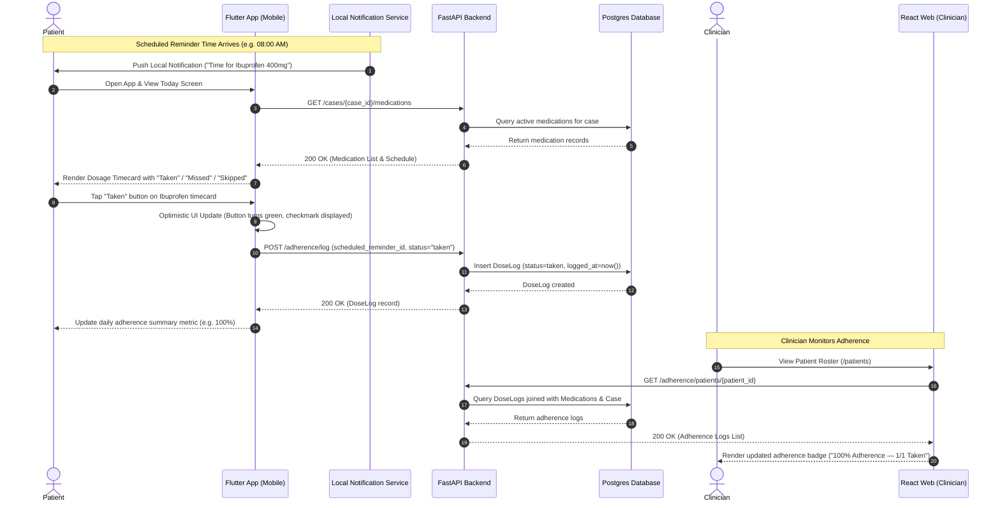

# Remote CarePro — End-to-End Service Blueprint

**Document ID:** `docs/product/02-service-blueprint.md`  
**Generated Date:** 2026-07-22  
**Role:** Lead Product, UX, and Technical-Design Agent  
**Status:** Approved Service Blueprint

---

## 1. System Overview & Actors

Remote CarePro is a closed-loop clinical post-surgery care platform connecting clinicians and patients. This blueprint maps the end-to-end service architecture across frontstage interactions, system feedbacks, backend APIs, data models, authentication boundaries, failure modes, audit needs, and analytics telemetry.

### 1.1 System Actors & Tiers

```
┌──────────────────────────────────────────────────────────────────────────────────┐
│                               FRONTSTAGE TIER                                    │
│  • Patient (Mobile App User)          • Clinician (Web Dashboard User)          │
└──────────────────────────────────────────────────────────────────────────────────┘
                                         │
┌──────────────────────────────────────────────────────────────────────────────────┐
│                                TOUCHPOINT TIER                                   │
│  • Flutter Mobile App (iOS / Android)  • React Web Dashboard (Chrome / Desktop)   │
└──────────────────────────────────────────────────────────────────────────────────┘
                                         │
┌──────────────────────────────────────────────────────────────────────────────────┐
│                                BACKSTAGE SERVICES                                │
│  • FastAPI REST Engine                • Local / Cognito Auth Provider            │
│  • Local Notifications Service        • openFDA / Fixture Data Integration       │
│  • Bedrock / LLM Guardrail Layer      • Postgres Database & RLS Security         │
└──────────────────────────────────────────────────────────────────────────────────┘
```

*Note: Caregiver role is excluded from MVP scope in alignment with the product strategy (`docs/product/01-ux-product-strategy.md`).*

---

## 2. Normal Dose-Log Sequence (Mermaid Diagram)

The sequence below details the normal operation of Stage 6: **Patient opens Today and logs a dose as taken**.



---

## 3. Stage-by-Stage Service Blueprint

---

### Stage 1: Clinician Login

* **User Goal**: Authenticate into the clinician web portal securely to access patient records and author care plans.
* **Frontstage UI Action**: Clinician navigates to `http://localhost:5173/login` (`LoginPage.tsx`), enters email & password, and clicks **Log in**.
* **App / System Feedback**: Button displays "Logging in...", input fields disable during transport. Upon success, redirects to `/patients`. Upon failure, displays an inline red error toast: *"Invalid email or password"*.
* **API Request & Data Affected**:
  * `POST /auth/login` (or `/auth/dev-login`) with `{ email, password }`.
  * *Data Affected*: Generates HS256 JWT containing `{ sub: user.id, role: "clinician", email: user.email }`. Persists token & role to `localStorage`.
* **Roles / Permissions**: Public route; backend verifies `User.role == "clinician"` or `"admin"`.
* **Failure Modes**: Network disconnect, invalid credentials, database unreachable, non-clinician account attempt.
* **Safe Recovery Path**: Maintain typed email in state, clear password field, highlight input border in red, display clear error text, offer developer bypass button (`dev-login`) in dev environments.
* **Audit / Logging Need**: Log authentication attempt timestamp, source IP, user ID, and success/failure result in ASGI application logs.
* **Product Event to Measure**: `clinician_login_success`, `clinician_login_failed`.

---

### Stage 2: Create Patient & Send Invite

* **User Goal**: Register a new post-surgery patient case and generate an invitation code for mobile app setup.
* **Frontstage UI Action**: Clinician navigates to `/patients/new` (`CreatePatientPage.tsx`), inputs Full Name ("Maria Rossi"), Patient Email, Surgery Type ("Knee Replacement"), Emergency Contact Phone, and clicks **Invite Patient**.
* **App / System Feedback**: Button updates to "Inviting...". Upon success, transforms screen to a **Patient Invited ✓** card, displaying a 6-digit invite code in prominent 32px text with instructions to share with the patient.
* **API Request & Data Affected**:
  * `POST /patients/invite` with `{ full_name, email, surgery_type, emergency_contact_phone }`.
  * *Data Affected*: Creates a `User` record (`role="patient"`, `status="pending_onboarding"`, 6-digit `invite_code`) and an associated `Case` record (`surgery_type`, `emergency_contact_name`, `emergency_contact_phone`).
* **Roles / Permissions**: Requires Bearer JWT with `clinician` or `admin` role (`require_clinician`).
* **Failure Modes**: Email already registered, missing required inputs, database transaction failure.
* **Safe Recovery Path**: Display inline error message (*"User with this email already exists"*), preserve form state for editing, do not clear entered name/surgery.
* **Audit / Logging Need**: Audit log entry capturing `clinician_id`, `patient_id`, `case_id`, `invite_code`, and timestamp.
* **Product Event to Measure**: `patient_invite_created`.

---

### Stage 3: Patient Accepts Invite & Signs In

* **User Goal**: Claim patient invitation code, create password, complete profile, and enter mobile app.
* **Frontstage UI Action**: Patient opens Flutter app, taps **Sign Up** from onboarding, enters email + 6-digit invite code on Step 1 (`SignupStep1Screen`), creates password on Step 2 (`SignupStep2Screen`), completes DOB & phone on Step 3 (`SignupStep3Screen`).
* **App / System Feedback**: Input validation indicators; submit buttons show loading spinners; upon completion, smoothly transitions to `MainShellPage` (`/main`) landing on the `TodayScreen`.
* **API Request & Data Affected**:
  * `POST /auth/verify-invite` with `{ email, invite_code }`.
  * `POST /auth/complete-onboarding` with `{ email, invite_code, password, date_of_birth, phone }`.
  * *Data Affected*: Hashes password (bcrypt), sets `date_of_birth` and `phone`, updates `User.status="active"`, clears `invite_code`, and issues Bearer JWT token.
* **Roles / Permissions**: Public routes; verifies invite code against `pending_onboarding` status.
* **Failure Modes**: Invalid/expired code, network disconnect during password hashing, weak password submission.
* **Safe Recovery Path**: Step 1 displays *"Invalid email or invite code"*; allows re-entry or prompt to request a new code from clinician. Step 2 & 3 preserve entered inputs on network retry.
* **Audit / Logging Need**: Log patient onboarding completion event with `patient_id`, timestamp, and account status transition (`pending_onboarding` $\rightarrow$ `active`).
* **Product Event to Measure**: `patient_onboarding_completed`, `verify_invite_failed`.

---

### Stage 4: Clinician Creates or Edits a Treatment Plan

* **User Goal**: Author authoritative medications and post-surgery recovery instructions for a patient's case.
* **Frontstage UI Action**: Clinician navigates to `/cases/:caseId/medications` (`MedicationsPage.tsx`) to enter drug name, dose, frequency, duration days, notes; and `/cases/:caseId/recommendations` (`RecommendationsPage.tsx`) to write recovery instructions (or draft via AI drawer).
* **App / System Feedback**: Form fields validate input types; "Add Medication" / "Save Recommendations" buttons show loading state; success card confirms submission with buttons to "View All" or "Back to Patients".
* **API Request & Data Affected**:
  * `POST /cases/{case_id}/medications` with `{ name, dose, schedule_text, duration, notes }`.
  * `POST /cases/{case_id}/recommendations` with `{ text }`.
  * *Data Affected*: Inserts new `Medication` or `Recommendation` records linked to `case_id`.
* **Roles / Permissions**: Requires Bearer JWT with `clinician` role; verifies clinician owns the target case.
* **Failure Modes**: Invalid case ID, empty required fields, unsaved form navigation, database timeout.
* **Safe Recovery Path**: Form field error highlighting, prompt alert on unsaved changes, retain typed content in local component state.
* **Audit / Logging Need**: Audit log capturing `clinician_id`, `case_id`, `medication_id` / `recommendation_id`, and content payload timestamp.
* **Product Event to Measure**: `medication_prescribed`, `recommendation_added`.

---

### Stage 5: Medication Schedule is Generated & Reaches the Patient

* **User Goal**: Automatically receive the clinician-prescribed regimen and local dosage reminders on the mobile app.
* **Frontstage UI Action**: Patient launches mobile app or returns to foreground; system runs background synchronization.
* **App / System Feedback**: `TodayScreen` populates medication timecards automatically with zero manual entry; OS prompts for notification permission if not yet granted; local reminders are scheduled.
* **API Request & Data Affected**:
  * `GET /patients/{id}/case` and `GET /cases/{case_id}/medications`.
  * *Data Affected*: Reads active `Case` and `Medication` records; initializes `flutter_local_notifications` schedule.
* **Roles / Permissions**: Requires Bearer JWT with `patient` role matching `patient_id`.
* **Failure Modes**: OS notification permission denied, network failure during fetch, empty medication plan.
* **Safe Recovery Path**: Display in-app banner (*"Notifications disabled — check app daily for reminders"*); cache fetched regimen locally in SQLite/secure storage for offline access.
* **Audit / Logging Need**: Log local notification scheduling initialization timestamp and device notification permission state.
* **Product Event to Measure**: `regimen_synced_mobile`, `local_notifications_scheduled`.

---

### Stage 6: Patient Opens Today & Logs a Dose (Normal Flow)

* **User Goal**: Mark a scheduled medication dose as taken in 1 tap.
* **Frontstage UI Action**: Patient receives a local reminder notification or opens app to `TodayScreen`, views dosage timecard, and taps the **Taken** pill button.
* **App / System Feedback**: Pill button animates immediately to a solid green checkmark state (*"Taken at 08:30 AM"*); the daily adherence progress metric updates percentage instantly.
* **API Request & Data Affected**:
  * `POST /adherence/log` with `{ scheduled_reminder_id, status: "taken" }`.
  * *Data Affected*: Inserts `DoseLog` record with `logged_at=datetime.utcnow()`.
* **Roles / Permissions**: Requires Bearer JWT with `patient` role.
* **Failure Modes**: Network disconnect during tap, duplicate button tap.
* **Safe Recovery Path**: Optimistic UI update in Flutter Riverpod state; background queue retries `POST /adherence/log` upon network reconnect; backend idempotency check prevents duplicate log rows.
* **Audit / Logging Need**: Log dose status transition (`pending` $\rightarrow$ `taken`), `scheduled_reminder_id`, `patient_id`, timestamp.
* **Product Event to Measure**: `dose_logged_taken`.

---

### Stage 7: Patient Skips, Misses, or Cannot Log a Dose

* **User Goal**: Record when a dose was intentionally skipped, missed due to schedule, or unable to be taken.
* **Frontstage UI Action**: Patient taps **Skipped** or **Missed** pill button on a dosage timecard (or system flags past unlogged reminders as missed).
* **App / System Feedback**: Timecard badge transitions to Amber (*"Skipped"*) or Red (*"Missed"*); supportive text confirms status logged without punitive or shaming copy.
* **API Request & Data Affected**:
  * `POST /adherence/log` with `{ scheduled_reminder_id, status: "skipped" | "missed" }`.
  * *Data Affected*: Inserts `DoseLog` record with selected status and timestamp.
* **Roles / Permissions**: Requires Bearer JWT with `patient` role.
* **Failure Modes**: Accidental mis-tap, offline status during logging.
* **Safe Recovery Path**: Provide a 5-second "Undo / Change Status" snackbar toast; optimistic UI updates queued for background sync on reconnect.
* **Audit / Logging Need**: Log non-adherence event type, `scheduled_reminder_id`, `patient_id`, timestamp.
* **Product Event to Measure**: `dose_logged_skipped`, `dose_logged_missed`.

---

### Stage 8: Patient Completes Symptom / Recovery Check-In

* **User Goal**: Log daily post-surgery recovery feeling (`Great`, `Ok`, `Not Great`, `Bad`) to inform care team.
* **Frontstage UI Action**: Patient navigates to `CheckInScreen` (Tab 1), selects one of 4 feeling buttons, and taps **Submit Check-In**.
* **App / System Feedback**: Selected card highlights in primary green theme; confirmation banner *"Check-in logged for today ✓"* appears; disables re-submission for the current calendar day.
* **API Request & Data Affected**:
  * `POST /symptoms/checkin` with `{ case_id, feeling }`.
  * *Data Affected*: Inserts `CheckIn` record with `checkin_date=date.today()`.
* **Roles / Permissions**: Requires Bearer JWT with `patient` role.
* **Failure Modes**: Multiple submission attempts in one day, network disconnect.
* **Safe Recovery Path**: Backend records latest check-in for the date; mobile app caches submitted status locally for the calendar day.
* **Audit / Logging Need**: Log check-in submission event, `case_id`, `patient_id`, feeling value, timestamp.
* **Product Event to Measure**: `symptom_checkin_submitted`.

---

### Stage 9: Patient Reads FDA Safety Content

* **User Goal**: Review authoritative, plain-language FDA safety information for prescribed medications.
* **Frontstage UI Action**: Patient views `RecoveryScreen` (Tab 3) drug safety section or taps **FDA Info** button on a medication.
* **App / System Feedback**: Renders an FDA safety card displaying drug name, source badge ("openFDA"), retrieved timestamp, bulleted AI warnings summary, and explicit disclaimer: *"Informational only — consult your clinician."*
* **API Request & Data Affected**:
  * `GET /fda/drug/{name}`.
  * *Data Affected*: Fetches raw openFDA label data via `FDAProvider` (Live or Fixture), generates LLM summary, returns `FDADrugInfoResponse`.
* **Roles / Permissions**: Requires Bearer JWT with `patient` or `clinician` role.
* **Failure Modes**: openFDA API rate limit/timeout, LLM summarization error, sparse label data.
* **Safe Recovery Path**: Fallback to `FixtureFDAProvider` static warnings or raw warning snippet; display clear fallback message: *"FDA summary cached; view official FDA site."*
* **Audit / Logging Need**: Log FDA API call drug name, provider source (`live` vs `fixture`), response latency.
* **Product Event to Measure**: `fda_safety_viewed`.

---

### Stage 10: Patient Asks the AI Assistant

* **User Goal**: Ask questions regarding prescribed medications or recovery instructions in natural language.
* **Frontstage UI Action**: Patient opens `AssistantScreen` (Tab 2), types a question in chat input (*"Can I take ibuprofen with food?"* or *"Can I double my dose?"*), and taps **Send**.
* **App / System Feedback**: User message bubble appears on right; typing indicator displays *"Thinking..."*; assistant reply renders on left. If an out-of-scope query is detected, displays a red-bordered guardrail warning banner with a **Call Emergency Contact** button.
* **API Request & Data Affected**:
  * `POST /ai/chat` with `{ case_id, message }`.
  * *Data Affected*: Evaluates `OUT_OF_SCOPE_MARKERS`, constructs prompt preamble from case medications/recommendations, queries `LLMProvider`, and inserts two `ChatMessage` records (`user` & `assistant`).
* **Roles / Permissions**: Requires Bearer JWT with `patient` role matching `case.patient_id`.
* **Failure Modes**: LLM provider downtime, out-of-scope/dangerous prompt (asking for dosage changes/diagnosis), prompt injection.
* **Safe Recovery Path**: Hardcoded regex guardrail intercepts dangerous queries with pre-approved refusal (*"I cannot assist with dose changes — please contact your clinician"*), surfaces emergency contact phone, and preserves conversation history.
* **Audit / Logging Need**: Audit log of all chat queries, guardrail trigger flags (`in_scope=false`, `escalate=true`), session ID, LLM latency.
* **Product Event to Measure**: `ai_chat_query_sent`, `ai_guardrail_triggered`.

---

### Stage 11: Clinician Reviews Patient Status & Follows Up

* **User Goal**: Monitor patient adherence rates, review check-in trends, and identify non-compliant or high-risk patients for clinical follow-up.
* **Frontstage UI Action**: Clinician views `PatientsPage` (`/patients`), reviews patient list cards, checks adherence badges and recent check-in trends, and clicks patient contact links if follow-up is needed.
* **App / System Feedback**: Patient card renders adherence score (e.g. *"92% Adherence — 14/15 Taken"*), color-coded status pills (Green = Good, Red = Low Adherence / Bad Feeling), and patient emergency contact phone.
* **API Request & Data Affected**:
  * `GET /patients`, `GET /cases`, `GET /adherence/patients/{patient_id}`, `GET /symptoms/patients/{patient_id}/symptoms/trend`.
  * *Data Affected*: Queries `User`, `Case`, `DoseLog`, and `CheckIn` tables to calculate adherence metrics.
* **Roles / Permissions**: Requires Bearer JWT with `clinician` or `admin` role.
* **Failure Modes**: Missing adherence data for new patient, network timeout fetching telemetry.
* **Safe Recovery Path**: Display *"No logs recorded yet"* placeholder badge, retry button for failed telemetry calls, fallback to direct emergency contact phone card.
* **Audit / Logging Need**: Log clinician access to patient adherence telemetry (HIPAA audit log compliance requirement).
* **Product Event to Measure**: `clinician_review_adherence`, `clinician_followup_initiated`.

---

## 4. Stage Matrix & Measurement Summary

| Stage | Primary Actor | Frontstage Touchpoint | Core API Endpoint | Primary Failure Mode | Product Metric |
|---|---|---|---|---|---|
| **1. Login** | Clinician | React Web (`/login`) | `POST /auth/login` | Invalid credentials | `clinician_login_success` |
| **2. Invite** | Clinician | React Web (`/patients/new`) | `POST /patients/invite` | Email already exists | `patient_invite_created` |
| **3. Onboard** | Patient | Flutter Mobile (`/signup/step1-3`)| `POST /auth/complete-onboarding`| Invalid invite code | `patient_onboarding_completed` |
| **4. Prescribe** | Clinician | React Web (`/cases/:id/meds`) | `POST /cases/{id}/medications` | Unsaved form state | `medication_prescribed` |
| **5. Schedule** | Patient | Flutter Mobile (`TodayScreen`) | `GET /cases/{id}/medications` | Notifications blocked | `regimen_synced_mobile` |
| **6. Log Taken** | Patient | Flutter Mobile (`TodayScreen`) | `POST /adherence/log` | Network drop | `dose_logged_taken` |
| **7. Log Skip/Miss**| Patient | Flutter Mobile (`TodayScreen`) | `POST /adherence/log` | Accidental mis-tap | `dose_logged_skipped/missed` |
| **8. Check-In** | Patient | Flutter Mobile (`CheckInScreen`)| `POST /symptoms/checkin` | Duplicate daily entry | `symptom_checkin_submitted` |
| **9. FDA Info** | Patient | Flutter Mobile (`RecoveryScreen`)| `GET /fda/drug/{name}` | openFDA API timeout | `fda_safety_viewed` |
| **10. AI Chat** | Patient | Flutter Mobile (`AssistantScreen`)| `POST /ai/chat` | Out-of-scope query | `ai_guardrail_triggered` |
| **11. Triage Review**| Clinician | React Web (`/patients`) | `GET /adherence/patients/{id}` | Missing telemetry | `clinician_review_adherence` |
