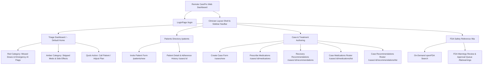

# Remote CarePro — Information Architecture Specification

**Document ID:** `docs/ux/05-information-architecture.md`  
**Generated Date:** 2026-07-22  
**Role:** Lead Product, UX, and Technical-Design Agent  
**Status:** Approved Information Architecture Specification

---

## 1. Executive Summary & Structural Strategy

This document defines the structural Information Architecture (IA) for both sides of the Remote CarePro platform:
1. **Flutter Patient Mobile App**: A patient-centered, low-cognitive-load mobile architecture prioritizing immediate 1-tap dose logging on launch, explicit visual separation of clinical authority vs. regulatory data vs. AI assistance, and calm task completion.
2. **React Clinician Web Dashboard**: A high-density, exception-driven clinical interface prioritizing a **"Needs Attention" Triage Dashboard** ahead of passive reports, and fast 2-step treatment plan authoring.

---

## 2. Information Architecture A: Flutter Patient Mobile App

### 2.1 Recommended Navigation Model

* **Primary Shell**: 5-Tab Bottom Navigation Bar (`MainShellPage`).
* **Core Philosophy**: **"Action First, Search Never"**. A recovering post-surgery patient landing on the app sees their next medication dose due right now above the fold on the first screen (`Today`), loggable in **1 tap**.
* **Daily Check-In Consolidation**: The daily symptom check-in is integrated as a top action card on `Today`, freeing tab space for dedicated `Medications` and `Recovery` views.

```
┌──────────────────────────────────────────────────────────────────────────────────┐
│                             FLUTTER MOBILE NAVIGATION                            │
├───────────────┬────────────────┬────────────────┬────────────────┬───────────────┤
│    TODAY      │  MEDICATIONS   │    RECOVERY    │   ASSISTANT    │    PROFILE    │
│   (Tab 0)     │    (Tab 1)     │    (Tab 2)     │    (Tab 3)     │    (Tab 4)    │
│  [DEFAULT]    │ [Clinician Med]│ [Clinician Rec]│ [AI Chat RAG]  │  [Settings]   │
└───────────────┴────────────────┴────────────────┴────────────────┴───────────────┘
```

### 2.2 Content Allocation Matrix

| Navigation Tab | Primary Content & Components | Interaction Goal | Source Authority & Tagging |
|---|---|---|---|
| **Today** (Tab 0) | • Patient Greeting & Date<br>• Daily Adherence Progress Pill (`80%`)<br>• Next Due Medication Timecard (1-tap `Taken`/`Missed`/`Skipped`)<br>• Daily Symptom Check-In Card (`Great`/`Ok`/`Not Great`/`Bad`) | Understand next action in $<3$ seconds; log dose in 1 tap | Clinician Prescription Schedule (`[AUTHORITATIVE]`) |
| **Medications** (Tab 1) | • Full Prescribed Medication List<br>• Read-Only Prescription Detail Sheet<br>• Clinician Dosage Notes ("Take with food")<br>• FDA Drug Safety Summary Trigger | Inspect active prescription list and exact clinician timing | Clinician Prescription (`[CLINICIAN AUTHORED]`) |
| **Recovery** (Tab 2) | • Clinician Emergency Contact Card (Direct Call CTA)<br>• Clinician Recovery Instructions (Wound care, ice, limits)<br>• FDA Safety Summaries Card | Review post-surgery care instructions & emergency contact | Clinician Recs (`[CLINICIAN]`) & openFDA (`[REGULATORY]`) |
| **Assistant** (Tab 3) | • 24/7 Context-Aware Chat Interface<br>• Informational Disclaimer Header<br>• Out-of-Scope Guardrail Refusal Box<br>• Emergency Contact CTA | Get bounded answers to medication/recovery questions | Bedrock AI RAG (`[AI - INFORMATIONAL ONLY]`) |
| **Profile** (Tab 4) | • Patient Account Info & DOB<br>• Clinic & Care Team Details<br>• Security & Auto-Lock Settings<br>• Language Selector (English/Spanish)<br>• Logout Button | Manage account settings and privacy | System & Patient Profile |

### 2.3 Visual & Conceptual Distinction of Content Sources

To ensure patient safety and prevent confusion between clinical orders, regulatory advice, and AI outputs, the IA enforces three explicit visual metadata badges across all screens:

```
┌──────────────────────────────────────────────────────────────────────────────────┐
│ 🟦 CLINICIAN AUTHORED   │ Lock Icon + Blue Badge   │ Authoritative, Unmodifiable  │
│ 🟨 FDA REGULATORY DATA  │ Shield Icon + Gold Badge │ Informational + Date Stamp   │
│ 🟪 AI ASSISTANT REPLY   │ Bot Icon + Purple Badge  │ Bounded + Non-Diagnostic     │
└──────────────────────────────────────────────────────────────────────────────────┘
```

### 2.4 Mobile Sitemap (Mermaid)

```mermaid
graph TD
    App[Remote CarePro Mobile App] --> Auth[Auth & Onboarding Flow]
    App --> MainShell[MainShellPage - 5 Tab Bottom Nav]

    Auth --> Onboarding[OnboardingScreen /onboarding]
    Auth --> Login[LoginScreen /login]
    Auth --> Signup1[SignupStep1: Invite Code /signup/step1]
    Auth --> Signup2[SignupStep2: Password /signup/step2]
    Auth --> Signup3[SignupStep3: Profile DOB/Phone /signup/step3]
    Auth --> Forgot[ForgotPasswordScreen /forgot-password]

    MainShell --> Today[Tab 0: Today - Default Home]
    MainShell --> Meds[Tab 1: Medications]
    MainShell --> Recovery[Tab 2: Recovery]
    MainShell --> Assistant[Tab 3: Assistant AI]
    MainShell --> ProfileTab[Tab 4: Profile]

    Today --> DoseLog[1-Tap Dose Action: Taken / Missed / Skipped]
    Today --> CheckIn[Daily Feeling Card: Great / Ok / Not Great / Bad]
    Today --> UndoToast[5-Sec Undo Toast]

    Meds --> MedDetail[Medication Detail Sheet - Read Only]
    Meds --> FDASummaryModal[FDA Safety Summary Modal]

    Recovery --> EmergencyCard[Emergency Contact Card + Call CTA]
    Recovery --> RecsList[Clinician Recovery Instructions]
    Recovery --> FDACard[FDA Regulatory Safety Cards]

    Assistant --> ChatHistory[RAG Conversation History]
    Assistant --> GuardrailRefusal[Red Guardrail Box + Emergency CTA]

    ProfileTab --> CareTeamInfo[Clinic & Care Team Profile]
    ProfileTab --> AppSettings[Security, Auto-Lock & Language]
    ProfileTab --> Logout[Sign Out Action]
```



### 2.5 Rationale & Alternatives Rejected (Mobile)

* **Rationale for 5-Tab Structure**:
  Moving `Medications` to a top-level tab alongside `Today` and `Recovery` establishes a clear distinction between **daily operational actions** (`Today`), **prescribed drug reference** (`Medications`), and **non-drug recovery guidance** (`Recovery`). Consolidating the daily feeling check-in into a card on `Today` simplifies the primary tab navigation.
* **Alternatives Rejected**:
  1. *4-Tab Navigation with Standalone Check-In Tab (Current Implementation)*: Rejected because assigning an entire tab to a 1-tap daily check-in wasted prime navigation real estate, while hiding medication details inside `Today`.
  2. *Drawer / Hamburger Menu*: Rejected because recovering post-surgery patients with motor tremors or fatigue require visible, persistent bottom tab targets.
  3. *Patient Editable Prescriptions*: Rejected due to severe clinical safety risks (violates Constraint 1).

### 2.6 Route Mapping & Migration Notes (Mobile)

| Proposed Route / Tab | Existing Route / Screen | Changes & Migration Action |
|---|---|---|
| `/onboarding` | `OnboardingScreen` | Unchanged. |
| `/login` | `LoginScreen` | Unchanged. |
| `/signup/step1-3` | `SignupStep1-3Screen` | Unchanged. |
| `/main` (Tab 0: Today) | `TodayScreen` | **Enhanced**: Embed `CheckIn` widget card at top of Today feed; retain 1-tap dose logging. |
| `/main` (Tab 1: Medications) | Nested in `Today` | **Promoted**: Create dedicated `MedicationsScreen` tab for full prescription list & FDA lookup link. |
| `/main` (Tab 2: Recovery) | `RecoveryScreen` (was Tab 3) | **Re-ordered**: Shifted to Tab 2; retains emergency contact card & recovery instructions. |
| `/main` (Tab 3: Assistant) | `AssistantScreen` (was Tab 2) | **Re-ordered**: Shifted to Tab 3; retains RAG chat & guardrail refusal box. |
| `/main` (Tab 4: Profile) | `/profile` (was separate route) | **Promoted**: Embedded as Tab 4 in `MainShellPage` bottom nav. |

---

## 3. Information Architecture B: React Clinician Web Dashboard

### 3.1 Recommended Navigation & Dashboard Hierarchy

* **Primary Shell**: Left Collapsible Sidebar Navigation (`NavBar.tsx`).
* **Core Philosophy**: **"Triage Ahead of Reports"**. Clinicians opening the dashboard land directly on the **Triage & Exceptions Dashboard ("Needs Attention")**, prioritizing non-compliant patients (Missed 2+ doses, Skipped for side effects, Bad check-ins, AI emergency flags) BEFORE presenting passive charts or rosters.
* **Fast 2-Step Authoring**: Prescribing medications and recovery instructions is streamlined into a contiguous 2-step wizard accessible from any patient profile.

```
┌──────────────────────────────────────────────────────────────────────────────────┐
│                            CLINICIAN WEB DASHBOARD                               │
├─────────────────┬─────────────────┬──────────────────┬───────────────────────────┤
│ 🚨 NEEDS ATTENTION│ 👥 PATIENTS     │ 📋 CASE AUTHORING │ 🛡️ FDA SAFETY & QUEUE     │
│   (Default /)   │   (/patients)   │   (/cases/new)   │         (/fda)            │
│ [High-Risk First]│ [Roster Directory]│ [Fast 2-Step Plan]│ [Regulatory & Review Queue]│
└─────────────────┴─────────────────┴──────────────────┴───────────────────────────┘
```

### 3.2 Triage & Patient Data Visibility Rules

#### Minimum Data Visible on Patient List (`/patients`)
1. **Patient Identifier**: Full Name, DOB, Patient Email.
2. **Active Case Summary**: Surgery Type (e.g. "Knee Replacement"), Surgery Date, Case Status (`open`/`closed`).
3. **Invitation Metadata**: Status (`active` vs `pending_onboarding`), 6-digit Invite Code (if pending).
4. **Adherence Telemetry Badge**: Overall Adherence % (e.g. `92% — 14/15 Taken`), color-coded badge.
5. **Triage Status Indicator**:
   - 🔴 **Red (Critical)**: Missed $\ge 2$ consecutive doses OR "Bad" check-in OR AI emergency query flagged.
   - 🟡 **Amber (Warning)**: Skipped due to side effects OR Adherence $<80\%$.
   - 🟢 **Green (Stable)**: Adherence $\ge 80\%$, check-in "Great"/"Ok".
6. **Quick Actions**: `+ New Case`, `Prescribe Meds`, `Recovery Recs`, `Call Patient`.

#### Minimum Data Visible on Patient Detail (`/cases/:id`)
1. **Header Card**: Patient Name, DOB, Allergies list, Emergency Contact Name & Phone (`tel:` dialer link).
2. **Adherence Timeline**: Chronological log list showing Medication Name, Scheduled Time, Status (`taken`/`missed`/`skipped`), Logged Time, and Patient Notes.
3. **Symptom Trend Graph**: 14-day Check-In feeling trend counts (`Great`, `Ok`, `Not Great`, `Bad`).
4. **Active Prescriptions List**: Medication Name, Dose, Frequency, Duration, Clinician Notes, Delete action.
5. **Recovery Instructions List**: Structured recovery recs, edit action button.

### 3.3 Clinician Sitemap (Mermaid)



### 3.4 Rationale & Alternatives Rejected (Web)

* **Rationale for Triage-First Dashboard**:
  Clinicians managing 30+ post-surgery cases do not have time to manually open every patient profile to check compliance. Placing a **Triage & Exceptions Dashboard ("Needs Attention")** as the default home screen immediately surfaces the 3-5 patients who require urgent follow-up, transforming passive data into clinical intelligence.
* **Alternatives Rejected**:
  1. *Passive Analytics Home (Charts First)*: Rejected because high-level aggregate charts hide individual non-compliant patients who need immediate clinical outreach.
  2. *Single-Page Everything Drawer*: Rejected because cramming prescribing forms, patient lists, and FDA lookups into one dense view created high cognitive overload and slow form input.

### 3.5 Route Mapping & Migration Notes (Web)

| Proposed Route | Existing Route / Page | Changes & Migration Action |
|---|---|---|
| `/` (Default Home) | Redirects to `/login` | **New Default View**: Implement `TriageDashboardPage` as home (`/`), rendering exception alerts ahead of roster. |
| `/login` | `LoginPage.tsx` | Unchanged. |
| `/patients` | `PatientsPage.tsx` | **Enhanced**: Add color-coded Triage Status Badges (Red/Amber/Green) and 6-digit invite code display to patient cards. |
| `/patients/new` | `CreatePatientPage.tsx` | Unchanged. |
| `/cases/new` | `CreateCasePage.tsx` | Unchanged. |
| `/cases/:id/medications` | `MedicationsPage.tsx` | Unchanged; retains direct FDA Check link. |
| `/cases/:id/medications/list` | `MedicationsListPage.tsx` | Unchanged. |
| `/cases/:id/recommendations` | `RecommendationsPage.tsx` | Unchanged; retains AI assistant drawer. |
| `/cases/:id/recommendations/list` | `RecommendationsListPage.tsx` | Unchanged. |
| `/fda` | `FDAPage.tsx` | **Enhanced**: Embed FDA Warning Approval Queue (`/fda/warnings`) below the drug search bar. |

---

## 4. Summary Matrix: Information Architecture Standards

| System Area | Navigation Pattern | Primary Default View | Key Information Above Fold | Migration Complexity |
|---|---|---|---|---|
| **Patient Mobile** | 5-Tab Bottom Navigation Bar | `TodayScreen` (Tab 0) | Next due dose timecard + 1-tap `Taken` button + Daily Check-In card | **Low**: Shift tabs in `MainShellPage`, embed check-in card in `TodayScreen`. |
| **Clinician Web** | Left Sidebar Navigation Shell | `TriageDashboard` (`/`) | Red/Amber Exception Alerts + High-Risk Patient List + Quick Contact Links | **Low**: Add triage home route, update `App.tsx` router & `PatientsPage.tsx` badges. |
